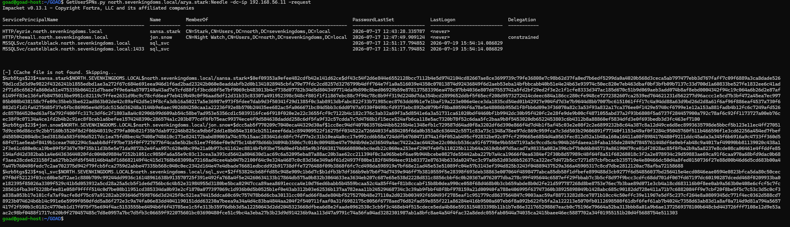
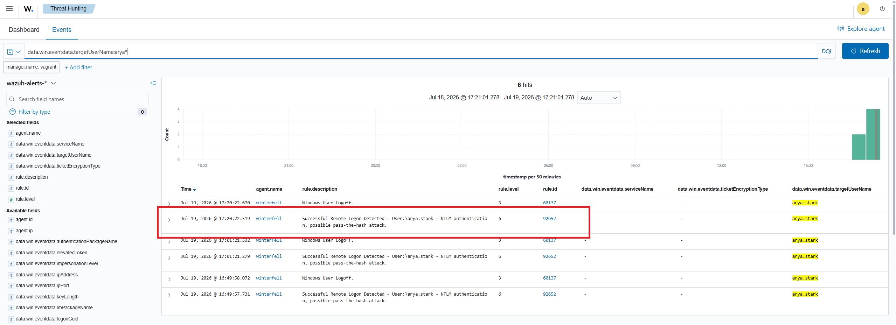

# ⚔️ Attaque 01 — Kerberoasting

| | |
|---|---|
| **Catégorie** | Credential Access |
| **MITRE ATT&CK** | [T1558.003](https://attack.mitre.org/techniques/T1558/003/) |
| **Fiche théorique** | [`../../docs/02-credential-access/05-kerberoasting.md`](../../docs/02-credential-access/05-kerberoasting.md) |
| **Cible** | `north.sevenkingdoms.local` — comptes de service avec SPN |
| **Compte attaquant** | n'importe quel compte de domaine (ici `jon.snow`) |
| **Outil** | impacket — `GetUserSPNs.py` |
| **Statut détection Wazuh** | 🟡 Partielle — tickets RC4 visibles, non alertés |

---

## 1. 🧠 Description

> **Le concept en une phrase :** n'importe quel utilisateur du domaine peut demander un "bon de transport" (ticket Kerberos) pour un service — et ce bon est chiffré avec le mot de passe du compte de service. L'attaquant le récupère, rentre chez lui, et essaie de le craquer hors ligne.

Dans Windows, les services réseau (bases de données, serveurs web internes…) sont identifiés par un **SPN** (Service Principal Name) — une sorte d'adresse unique. Quand un utilisateur veut accéder à un service, il demande au contrôleur de domaine un **ticket TGS**, chiffré avec le hash du mot de passe du compte de service.

**La faille :** Kerberos permet à *n'importe quel* utilisateur authentifié de demander ce ticket — sans qu'on vérifie s'il a réellement le droit d'accéder au service. Et le ticket peut être demandé avec le chiffrement **RC4** (plus faible que AES), ce qui le rend plus rapide à cracker.

**Ce que fait l'attaquant :**
1. Il liste tous les comptes de service du domaine (ceux qui ont un SPN)
2. Il demande un ticket TGS pour chacun d'eux
3. Il exporte les tickets chiffrés et les craque hors ligne avec `hashcat` ou `john`
4. Si le mot de passe du compte de service est faible → compromis

## 2. 🎯 Prérequis

- Un **compte de domaine quelconque** (même sans aucun privilège)
- Des comptes de service avec des **mots de passe faibles** dans le domaine

## 3. 💻 Exécution

### Étape 1 — Lister les comptes de service et récupérer leurs tickets

```bash
GetUserSPNs.py north.sevenkingdoms.local/jon.snow:iknownothing -dc-ip 192.168.56.11 -request
```

| Élément | Rôle |
|---------|------|
| `GetUserSPNs.py` | outil impacket pour le Kerberoasting |
| `jon.snow:iknownothing` | compte lambda utilisé comme point d'entrée |
| `-request` | demander les tickets TGS en même temps que la liste |

La commande renvoie directement les **hashes à cracker**, au format `$krb5tgs$...`.



### Étape 2 — Cracker le hash hors ligne

```bash
hashcat -m 13100 hashes.txt wordlist.txt
```

Si le mot de passe du compte de service est dans la wordlist → il apparaît en clair.

## 4. 📤 Résultat

Les tickets des comptes à SPN sont récupérés et prêts à être crackés. Si un compte de service a un mot de passe faible ou présent dans une wordlist, l'attaquant obtient ses identifiants — et donc l'accès à tous les services qu'il gère.

## 5. 🛡️ Détection dans Wazuh — 🟡 partielle

**Recherche (Threat Hunting → Events) :**
```
data.win.system.eventID:4769 and data.win.eventdata.ticketEncryptionType:0x17
```

**Event Windows concerné :** `4769` (*Kerberos Service Ticket was requested*) avec `ticketEncryptionType: 0x17` (RC4 — le chiffrement faible demandé par l'attaquant).

**Résultat : 3 hits** — les demandes de tickets RC4 **sont bien collectées par Wazuh**. Le problème : elles **ressemblent à du trafic légitime** (de nombreuses applications legacy demandent encore RC4) → **non alertées** par défaut.



**Ce qui manque pour une vraie alerte :** une règle qui dit "si un compte demande beaucoup de tickets RC4 en peu de temps → suspect". C'est l'objet de la règle `100011` (Phase 5).

## 6. 🎓 Analyse & leçon

> **Ce qui rend cette attaque insidieuse :** elle n'exploite aucune faille logicielle. C'est une fonctionnalité normale de Kerberos, utilisée de manière abusive. L'attaque se fait entièrement hors ligne — le réseau ne voit qu'une demande de ticket ordinaire.

**Deux points clés :**
- Wazuh *voit* les events 4769 avec RC4, mais sans règle spécifique, il ne sait pas que c'est une attaque.
- La vraie défense est de s'assurer que les comptes de service ont des **mots de passe longs et complexes** (ou mieux : des **gMSA**, dont le mot de passe de 240 caractères est automatiquement géré par AD).

→ La règle `100011` (Phase 5) ajoute l'alerte manquante.

## 7. 🔧 Remédiation

- Utiliser des **gMSA** (Group Managed Service Accounts) — mots de passe de 240 caractères, changés automatiquement.
- Forcer le chiffrement **AES** (supprimer RC4) pour les comptes de service.
- Auditer régulièrement les SPN : limiter leur nombre, supprimer les comptes inutiles.
- Activer l'audit `4769` et alerter sur les demandes RC4 en volume (règle 100011, Phase 5).

---

⬅️ Retour à l'[index des attaques](../03-attaques.md)
