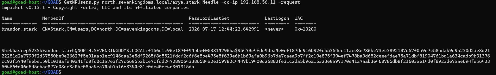

# ⚔️ Attaque 02 — AS-REP Roasting

| | |
|---|---|
| **Catégorie** | Credential Access |
| **MITRE ATT&CK** | [T1558.004](https://attack.mitre.org/techniques/T1558/004/) |
| **Fiche théorique** | [`../../docs/02-credential-access/06-asrep-roasting.md`](../../docs/02-credential-access/06-asrep-roasting.md) |
| **Cible** | `north.sevenkingdoms.local` — comptes sans pré-authentification |
| **Compte attaquant** | **aucun compte nécessaire** (attaque sans authentification) |
| **Outil** | impacket — `GetNPUsers.py` |
| **Statut détection Wazuh** | 🔴 Invisible par défaut → Règle 100014 (Phase 5) |

---

## 1. 🧠 Description

> **Le concept en une phrase :** certains comptes AD ont une option qui désactive une vérification de sécurité — l'attaquant peut alors leur demander un ticket chiffré *sans même avoir de compte*, et tenter de craquer ce ticket hors ligne.

Dans Kerberos, la **pré-authentification** est une protection : avant de recevoir un ticket, l'utilisateur doit prouver qu'il connaît son mot de passe (en chiffrant un timestamp). Cela empêche qu'un attaquant demande des tickets pour n'importe quel compte.

**La faille :** si l'option `"Do not require Kerberos preauthentication"` est cochée sur un compte, cette protection est désactivée. N'importe qui — même sans compte dans le domaine — peut alors demander un ticket AS-REP pour ce compte. Ce ticket est chiffré avec le hash du mot de passe de la victime → crackable hors ligne.

**Ce qui rend cette attaque encore plus dangereuse que le Kerberoasting :** pas besoin d'être authentifié dans le domaine. Un attaquant qui a juste un accès réseau au DC peut l'exécuter.

## 2. 🎯 Prérequis

- Un **accès réseau** au contrôleur de domaine (port 88 — Kerberos)
- Au moins un compte AD avec `"Do not require Kerberos preauthentication"` activé
- **Aucun compte de domaine nécessaire** pour l'attaque elle-même

## 3. 💻 Exécution

### Étape 1 — Récupérer les AS-REP des comptes vulnérables

```bash
GetNPUsers.py north.sevenkingdoms.local/ -usersfile /usr/share/wordlists/users.txt -no-pass -dc-ip 192.168.56.11
```

| Élément | Rôle |
|---------|------|
| `GetNPUsers.py` | outil impacket pour l'AS-REP Roasting |
| `-usersfile users.txt` | liste de noms d'utilisateurs à tester |
| `-no-pass` | **pas de mot de passe nécessaire** — c'est le principe de l'attaque |

Si un compte est vulnérable, le DC renvoie directement un hash AS-REP au format `$krb5asrep$...`.



### Étape 2 — Cracker le hash hors ligne

```bash
hashcat -m 18200 asrep_hashes.txt wordlist.txt
```

## 4. 📤 Résultat

Le hash AS-REP du compte vulnérable est récupéré. Si son mot de passe est dans la wordlist → compromis, sans avoir eu besoin d'aucun compte de domaine au départ.

## 5. 🛡️ Détection dans Wazuh — 🔴 invisible par défaut

**Recherche (Threat Hunting → Events) :**
```
data.win.system.eventID:4768 and data.win.eventdata.preAuthType:0
```

**Event Windows concerné :** `4768` (*Kerberos Authentication Service Request*) avec `preAuthType: 0` (aucune pré-authentification — le marqueur de la vulnérabilité).

**Résultat : 0 hit** — l'audit Kerberos AS (`4768`) n'est **pas activé par défaut** sur les DC. La demande de ticket a lieu, mais **aucun événement n'est écrit**.


**Ce qui manque :** activer l'audit `Kerberos Authentication Service` sur les DC, puis créer une règle qui alerte sur les `4768` avec `preAuthType: 0`. C'est l'objet de la règle `100014` (Phase 5).

## 6. 🎓 Analyse & leçon

> **L'attaque zéro pré-requis.** Contrairement au Kerberoasting qui nécessite au moins un compte de domaine, l'AS-REP Roasting peut se faire depuis l'extérieur avec juste un accès réseau. Un compte avec cette option activée est une porte d'entrée potentielle dans le domaine.

**Ce qu'il faut retenir :**
- L'audit Kerberos est désactivé par défaut → l'attaque est totalement invisible.
- La détection passe par **deux étapes** : activer l'audit 4768 sur les DC, puis écrire une règle Wazuh ciblant `preAuthType: 0`.
- La vraie correction est de **désactiver cette option** sur tous les comptes concernés (elle est rarement nécessaire).

## 7. 🔧 Remédiation

- **Désactiver** l'option `"Do not require Kerberos preauthentication"` sur tous les comptes (audit régulier via BloodHound ou PowerShell).
- Si l'option est requise pour compatibilité : imposer un **mot de passe très long** sur ce compte.
- Activer l'audit `Kerberos Authentication Service` (4768) et alerter sur `preAuthType: 0` (règle 100014, Phase 5).

---

⬅️ Retour à l'[index des attaques](../03-attaques.md)
