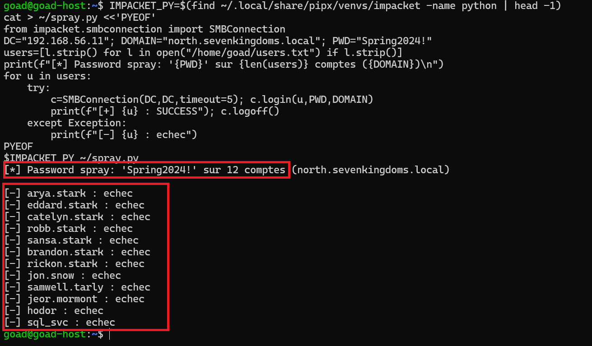

# ⚔️ Attaque 05 — Password Spraying

| | |
|---|---|
| **Catégorie** | Credential Access |
| **MITRE ATT&CK** | [T1110.003](https://attack.mitre.org/techniques/T1110/003/) |
| **Fiche théorique** | [`../../docs/02-credential-access/11-password-spraying.md`](../../docs/02-credential-access/11-password-spraying.md) |
| **Cible** | `north.sevenkingdoms.local` — tous les utilisateurs du domaine |
| **Compte attaquant** | aucun au départ (l'objectif est d'en obtenir un) |
| **Outil** | `kerbrute` |
| **Statut détection Wazuh** | ✅ Bien détecté — événements 4625 (échecs) visibles |

---

## 1. 🧠 Description

> **Le concept en une phrase :** au lieu d'essayer des milliers de mots de passe sur un seul compte (brute force — qui déclenche un verrouillage), l'attaquant essaie *un seul* mot de passe sur des centaines de comptes différents.

**Le problème du brute force classique :** Active Directory verrouille un compte après quelques tentatives échouées (souvent 5). Un attaquant qui essaie des milliers de mots de passe sur `administrator` va verrouiller ce compte en quelques secondes et déclencher immédiatement une alerte.

**La solution du password spraying :** tester le mot de passe `Printemps2024!` sur 500 comptes différents. Chaque compte ne reçoit qu'une seule tentative → pas de verrouillage. Et statistiquement, sur 500 comptes, il y en a souvent au moins un qui utilise un mot de passe basé sur la saison ou l'année.

**Les mots de passe les plus fréquemment testés :**
- Saison + année : `Hiver2024!`, `Ete2024@`
- Nom de l'entreprise + chiffre : `Dataprotect1!`
- Mots de passe par défaut : `Password123`, `Welcome1`

## 2. 🎯 Prérequis

- Une **liste d'utilisateurs** du domaine (obtenue à l'étape d'énumération)
- Un accès réseau au DC (port 88 — Kerberos)

## 3. 💻 Exécution

```bash
kerbrute passwordspray -d north.sevenkingdoms.local --dc 192.168.56.11 \
  users.txt 'iknownothing'
```

| Élément | Rôle |
|---------|------|
| `kerbrute` | outil de validation Kerberos rapide et discret |
| `passwordspray` | mode : un mot de passe, plusieurs comptes |
| `users.txt` | liste des noms d'utilisateurs du domaine |
| `'iknownothing'` | le mot de passe testé sur tous les comptes |

`kerbrute` utilise Kerberos (pas LDAP) pour tester les identifiants — plus rapide et génère moins de bruit que les tentatives LDAP/SMB classiques.



## 4. 📤 Résultat

Si au moins un compte du domaine utilise le mot de passe testé, `kerbrute` le signale. L'attaquant a maintenant un **premier pied dans le domaine** — un compte valide pour commencer l'énumération et les attaques suivantes.

## 5. 🛡️ Détection dans Wazuh — ✅ bien détecté

**Recherche (Threat Hunting → Events) :**
```
data.win.system.eventID:4625 and data.win.eventdata.failureReason:*
```

**Event Windows concerné :** `4625` (*An account failed to log on*) — généré pour chaque tentative échouée.

**Résultat : de nombreux hits** — les tentatives échouées **sont bien collectées**. Une vague de `4625` en rafale depuis la même IP est un signal classique de spraying.


**Ce qui fonctionne ici :** contrairement aux attaques de reconnaissance ou aux attaques Kerberos avancées, le password spraying laisse des traces directes et reconnaissables : beaucoup d'échecs d'authentification, depuis la même source, en peu de temps, sur des comptes différents.

**Limite :** si l'attaquant espace ses tentatives dans le temps (une toutes les heures), la corrélation devient plus difficile.

## 6. 🎓 Analyse & leçon

> **La seule attaque clairement détectable par Wazuh par défaut.** Elle illustre ce que le SIEM fait bien : détecter les comportements bruyants avec des patterns simples. Les attaques sophistiquées (Golden Ticket, ADCS ESC1) sont silencieuses par nature — le password spraying non.

**Ce qu'il faut retenir :**
- La détection fonctionne parce que l'attaque génère des événements `4625` en volume — un signal fort et peu ambigu.
- Un attaquant patient peut contourner la détection en espaçant ses tentatives.
- La vraie protection est une **politique de mots de passe forte** + **MFA** : même si un mot de passe est deviné, MFA bloque l'accès.

## 7. 🔧 Remédiation

- Imposer une **politique de mots de passe forte** : longueur ≥ 14 caractères, renouvellement, liste noire des mots communs.
- Activer le **MFA** sur tous les accès (VPN, Outlook, portails RH…).
- Surveiller les vagues de `4625` depuis une même IP (alerte Wazuh sur le count).
- Mettre en place un **verrouillage progressif** et des alertes sur les lockouts multiples.

---

⬅️ Retour à l'[index des attaques](../03-attaques.md)
