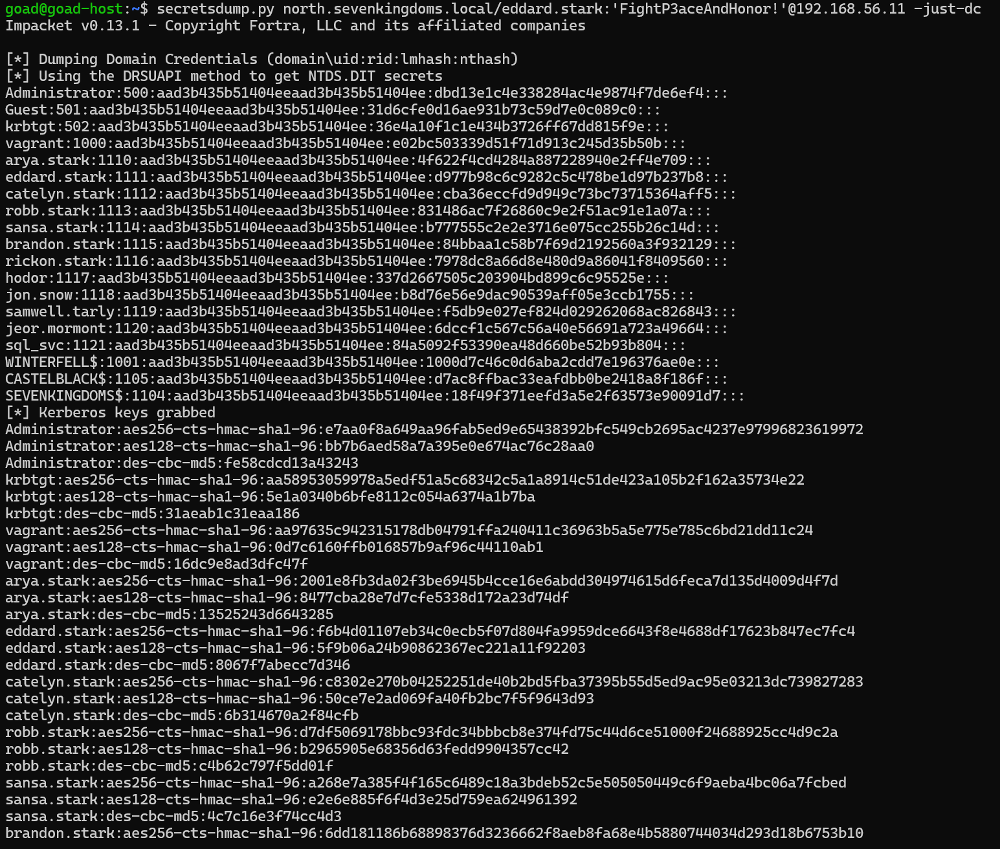
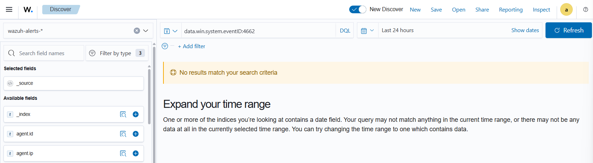

# ⚔️ Attaque 06 — DCSync (Réplication du contrôleur de domaine)

| | |
|---|---|
| **Catégorie** | Credential Access |
| **MITRE ATT&CK** | [T1003.006](https://attack.mitre.org/techniques/T1003/006/) |
| **Fiche théorique** | [`../../docs/02-credential-access/08-dcsync.md`](../../docs/02-credential-access/08-dcsync.md) |
| **Cible** | `north.sevenkingdoms.local` (DC02 / winterfell · 192.168.56.11) |
| **Compte attaquant** | `eddard.stark` (Domain Admin) |
| **Outil** | impacket — `secretsdump.py` |
| **Statut détection Wazuh** | 🔴 Invisible par défaut → Règle 100010 (Phase 5) |

---

## 1. 🧠 Description

> **Le concept en une phrase :** les contrôleurs de domaine se synchronisent entre eux — un attaquant peut se faire passer pour un DC et demander à l'autre de lui envoyer tous les hashs de mots de passe.

Dans une entreprise avec plusieurs DC, ils se **répliquent** en permanence : si un mot de passe change sur l'un, il se propage aux autres. Ce mécanisme s'appelle **DRS** (Directory Replication Service). Pour l'utiliser, il faut avoir un droit AD spécial : `DS-Replication-Get-Changes-All`.

**La faille :** si un compte (Domain Admin, ou un compte avec ce droit ajouté par erreur) est compromis, l'attaquant peut **simuler une réplication DC** et demander à recevoir la base complète des mots de passe (le fichier NTDS.dit) — sans jamais toucher les disques du serveur.

**Ce qui sort de DCSync :**
- Le hash NT de **tous** les comptes, y compris `Administrator` et `krbtgt`
- Le hash `krbtgt` permet de créer des Golden Tickets (attaque 11)
- Le hash `Administrator` permet le Pass-the-Hash (attaque 09)

C'est souvent **l'étape finale** d'une intrusion réussie : une fois qu'on a les droits suffisants, DCSync donne les clés de l'ensemble du domaine.

## 2. 🎯 Prérequis

- Un compte avec le droit **`DS-Replication-Get-Changes-All`** — typiquement un **Domain Admin**, ou tout compte auquel ce droit aurait été ajouté
- Ici : `eddard.stark` est Domain Admin → il a ces droits par défaut

## 3. 💻 Exécution

```bash
secretsdump.py 'north.sevenkingdoms.local/eddard.stark:FightP3aceAndHonor!@192.168.56.11' \
  -just-dc-user krbtgt
```

| Élément | Rôle |
|---------|------|
| `secretsdump.py` | outil impacket pour extraire les secrets AD |
| `eddard.stark:FightP3aceAndHonor!` | compte Domain Admin compromis |
| `@192.168.56.11` | adresse du contrôleur de domaine cible |
| `-just-dc-user krbtgt` | ne demander que le hash de `krbtgt` (la cible principale) |

Sans `-just-dc-user`, la commande extrait **tous** les comptes du domaine en quelques secondes.



## 4. 📤 Résultat

Les hashs NT de `krbtgt` et `Administrator` sont extraits. Avec le hash `krbtgt`, l'attaquant peut forger des Golden Tickets (persistance illimitée). Avec le hash `Administrator`, il peut faire du Pass-the-Hash sur tous les serveurs du domaine. **Le domaine est entièrement compromis.**

## 5. 🛡️ Détection dans Wazuh — 🔴 invisible par défaut

**Recherche (Threat Hunting → Events) :**
```
data.win.system.eventID:4662 and data.win.eventdata.properties:*1131f6aa*
```

**Event Windows concerné :** `4662` (*An operation was performed on an object*) avec le GUID `1131f6aa-...` qui identifie spécifiquement la réplication DCSync.

**Résultat : 0 hit** — l'audit **Directory Service Access** (qui génère les `4662`) n'est **pas activé par défaut**. La réplication a lieu, mais **aucun événement n'est écrit**.



**La chaîne complète pour détecter :** activer l'audit DS Access → Wazuh collecte les 4662 → la règle `100010` identifie le GUID de réplication → alerte.

## 6. 🎓 Analyse & leçon

> **L'attaque "clé universelle".** DCSync ne touche rien sur les disques, ne crée aucun fichier, ne modifie aucun compte — c'est une simple demande de réplication réseau. C'est précisément pour ça qu'elle est invisible : elle ressemble à du trafic AD normal, et sans l'audit activé, aucun log n'est écrit.

**Ce qu'il faut retenir :**
- L'audit `Directory Service Access` doit être activé sur les DC — ce n'est pas le cas par défaut.
- Une fois activé, le GUID `1131f6aa-9df6-11d1-f79f-00c04fc2dcd2` identifie précisément une demande de réplication DCSync (règle 100010, Phase 5).
- La vraie protection est de **limiter les droits de réplication** : seuls les vrais DC devraient avoir `DS-Replication-Get-Changes-All`.

## 7. 🔧 Remédiation

- **Activer l'audit `Directory Service Access`** sur les DC (GPO ou `auditpol`).
- **Auditer les droits de réplication** : qui possède `DS-Replication-Get-Changes-All` en dehors des DC ? (`Get-DomainObjectAcl` via PowerView)
- Mettre en place le **tiering** : les comptes Domain Admin ne doivent pas être utilisés pour des tâches quotidiennes.
- Alerter sur toute réplication provenant d'une machine qui n'est pas un DC (règle 100010, Phase 5).

---

⬅️ Retour à l'[index des attaques](../03-attaques.md)
