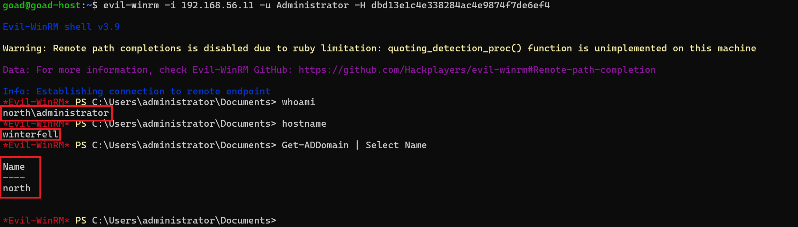

# ⚔️ Attaque 09 — Pass-the-Hash (PtH)

| | |
|---|---|
| **Catégorie** | Lateral Movement |
| **MITRE ATT&CK** | [T1550.002](https://attack.mitre.org/techniques/T1550/002/) |
| **Fiche théorique** | [`../../docs/03-lateral-movement/13-pass-the-hash.md`](../../docs/03-lateral-movement/13-pass-the-hash.md) |
| **Cible** | `north.sevenkingdoms.local` (DC02 / winterfell · 192.168.56.11) |
| **Compte attaquant** | `Administrator` (hash volé au **DCSync**) |
| **Outil** | evil-winrm (WinRM) |
| **Statut détection Wazuh** | 🟡 Partielle (connexions `4624` visibles mais non alertées) |

---

## 1. 🧠 Description

> **Le concept en une phrase :** Windows n'utilise pas le mot de passe lui-même pour s'authentifier, mais son "empreinte" (le hash) — voler cette empreinte suffit pour se connecter, sans jamais connaître le mot de passe.

Dans le protocole **NTLM**, Windows ne transmet jamais le mot de passe en clair sur le réseau. À la place, il envoie le **hash NT** — une version chiffrée du mot de passe. Pour s'authentifier, le client prouve qu'il possède ce hash en répondant à un défi.

**La faille :** si l'attaquant *possède le hash* (obtenu via DCSync, LSASS dump ou autre), il peut *envoyer directement ce hash* en réponse au défi — sans jamais connaître le mot de passe original. C'est le **Pass-the-Hash**.

> Analogie 🎫 : le hash est comme une empreinte de carte-clé. Voler une copie de l'empreinte permet de faire un double qui ouvre les mêmes portes.

**C'est la suite logique de DCSync :** DCSync vole les hashs → Pass-the-Hash les **utilise** pour accéder aux machines.

## 2. 🎯 Prérequis

- Le **hash NT** d'un compte à privilèges (ici l'`Administrator` du domaine, récupéré au [DCSync](06-dcsync.md) : `dbd13e1c4e338284ac4e9874f7de6ef4`)
- Un service d'accès distant ouvert (WinRM 5985, activé sur les DC de GOAD)

## 3. 💻 Exécution

> **Pourquoi WinRM et pas PSExec ?** Les outils impacket (`wmiexec`, `psexec`, `smbexec`) s'authentifient bien par hash, mais leur canal de retour (DCOM, named pipe) était instable sur ces VM imbriquées. **WinRM** via `evil-winrm` donne un shell interactif fiable.

```bash
evil-winrm -i 192.168.56.11 -u Administrator -H dbd13e1c4e338284ac4e9874f7de6ef4
```

| Élément | Rôle |
|---------|------|
| `evil-winrm` | shell distant via WinRM |
| `-i 192.168.56.11` | la cible (DC02 / winterfell) |
| `-u Administrator` | le compte usurpé |
| `-H dbd13e1c...` | **le hash NT** au lieu du mot de passe — c'est le Pass-the-Hash |



## 4. 📤 Résultat

Un **shell PowerShell interactif sur le contrôleur de domaine**, en tant que `north\administrator`, **sans aucun mot de passe** :
```
whoami   → north\administrator
hostname → winterfell
```
**Contrôle total du domaine `north.sevenkingdoms.local`.** Chaîne complète : **DCSync (vol) → Pass-the-Hash (usage) → domination.**

## 5. 🛡️ Détection dans Wazuh — 🟡 partielle

**Recherche (Threat Hunting → Events) :**
```
data.win.system.eventID:4624 and data.win.eventdata.ipAddress:192.168.56.1
```

**Event Windows concerné :** `4624` (*An account was successfully logged on*), type 3, `authenticationPackageName: NTLM`.

**Résultat : 14 hits** — les connexions réussies de l'attaquant (`Administrator` depuis `192.168.56.1`, NTLM) **sont bien collectées**. Mais elles **ressemblent à des connexions admin légitimes** → **non alertées** comme malveillantes par défaut.


**Ce qui distingue un PtH d'une connexion légitime :**
- Un admin légitime se connecte depuis une IP connue, à des heures habituelles
- Le PtH vient souvent d'une IP inhabituelle, à une heure bizarre, avec un pattern d'authentification NTLM atypique

→ C'est précisément ce que détecte l'**agent IA (Phase 6)** : la règle `100017` ajoute une alerte sur les logons NTLM de type 3 inhabituels.

## 6. 🎓 Analyse & leçon

> **Le PtH via WinRM est furtif.** Contrairement à `psexec` (qui crée un service → Event `7045`) ou `atexec` (qui crée une tâche planifiée → Event `4698`) — qui laissent des artefacts bruyants — WinRM ne laisse qu'un `4624` normal en apparence.

**Deux enseignements :**
- On détecte souvent une attaque par ses **effets de bord** (service ou tâche créés), pas par l'authentification elle-même.
- Détecter un PtH "propre" (WinRM) demande de **baseliner** le comportement normal : un admin qui se connecte depuis une IP/heure inhabituelle — c'est précisément le rôle de l'agent IA (Phase 6).

## 7. 🔧 Remédiation

- **Empêcher le vol de hashs** en amont : protéger LSASS (Credential Guard), limiter les Domain Admins, mettre en place le tiering.
- Activer **Credential Guard**, restreindre NTLM au profit de Kerberos.
- Surveiller les **connexions NTLM d'admins depuis des postes/heures inhabituels** (détection comportementale, Phase 6).

---

⬅️ Retour à l'[index des attaques](../03-attaques.md)
