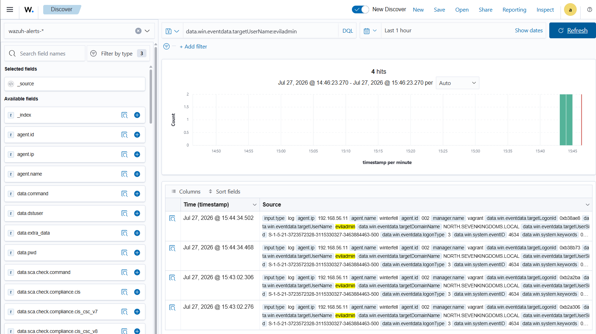

# ⚔️ Attaque 11 — Golden Ticket

| | |
|---|---|
| **Catégorie** | Persistence |
| **MITRE ATT&CK** | [T1558.001](https://attack.mitre.org/techniques/T1558/001/) |
| **Fiche théorique** | [`../../docs/04-privilege-escalation/18-golden-ticket.md`](../../docs/04-privilege-escalation/18-golden-ticket.md) |
| **Cible** | `north.sevenkingdoms.local` (DC02 / winterfell · 192.168.56.11) |
| **Compte attaquant** | `eviladmin` (**utilisateur inexistant, forgé**) |
| **Outil** | impacket — `ticketer.py` + `secretsdump.py -k` |
| **Statut détection Wazuh** | 🟡 Anomalie détectable (compte inexistant dans les logs) → Phase 6 |

---

## 1. 🧠 Description

> **Le concept en une phrase :** avec le hash du compte le plus secret du domaine (`krbtgt`), l'attaquant peut fabriquer lui-même un badge d'accès universel valide pour n'importe quel utilisateur — même un utilisateur qui n'existe pas.

Dans Kerberos, le **KDC** (Key Distribution Center, sur le DC) délivre des **TGT** — des "badges maîtres" qui prouvent l'identité d'un utilisateur. Chaque TGT est **signé avec le hash du compte spécial `krbtgt`**, le compte secret du domaine. Ce compte est le **sceau royal** du domaine 👑.

**La faille :** le hash de `krbtgt` a été volé au [DCSync](06-dcsync.md). Avec ce hash, l'attaquant peut **forger son propre TGT** — pour n'importe quel utilisateur, même inexistant, avec les privilèges qu'il veut, valable des années. Le DC accepte ce ticket car le sceau cryptographique est valide.

**Pourquoi c'est la persistance ultime :**
- Le ticket forgé reste valide **tant que le mot de passe de `krbtgt` n'est pas réinitialisé deux fois**
- Il peut se faire passer pour `Administrator`, un compte inexistant, ou n'importe qui
- Aucun log de création de ticket côté DC — le ticket est forgé localement

## 2. 🎯 Prérequis

- Le **hash NT de `krbtgt`** (`36e4a10f1c1e434b3726ff67dd815f9e`, volé au [DCSync](06-dcsync.md))
- Le **SID du domaine** (`S-1-5-21-3723572328-3115330327-3463884463`)

## 3. 💻 Exécution

### Étape 1 — Forger le Golden Ticket

```bash
ticketer.py -nthash 36e4a10f1c1e434b3726ff67dd815f9e \
  -domain-sid S-1-5-21-3723572328-3115330327-3463884463 \
  -domain north.sevenkingdoms.local eviladmin
```

| Élément | Rôle |
|---------|------|
| `-nthash 36e4a10f...` | hash de `krbtgt` — le "sceau royal" du domaine |
| `-domain-sid ...` | SID du domaine (pour que le ticket soit accepté) |
| `eviladmin` | nom du compte forgé — **n'existe pas dans l'AD** |

→ crée `eviladmin.ccache` (le Golden Ticket) localement, sans aucune interaction avec le DC.


### Étape 2 — Utiliser le ticket forgé

```bash
export KRB5CCNAME=eviladmin.ccache
secretsdump.py -k -no-pass -just-dc north.sevenkingdoms.local/eviladmin@winterfell.north.sevenkingdoms.local
```

→ le DC valide le ticket (le sceau `krbtgt` est correct), accepte `eviladmin` comme légitime, et lui donne accès.

## 4. 📤 Résultat

**`eviladmin` (un compte fantôme qui n'existe nulle part dans l'AD) dump TOUS les hashs du domaine** — uniquement parce que son ticket porte le sceau `krbtgt`. Contrôle total et **persistant** : l'attaquant peut revenir dans des semaines ou des mois avec le même ticket.


## 5. 🛡️ Détection dans Wazuh — 🟡 anomalie

**Recherche (Threat Hunting → Events) :**
```
data.win.eventdata.targetUserName:eviladmin
```

**Résultat : 4 hits.** Les logons de `eviladmin` **apparaissent bien** dans les logs (`4624`/`4634`). Deux **anomalies révélatrices** :

- 🚩 `targetUserName: eviladmin` = un **compte qui N'EXISTE PAS** dans l'AD apparaît dans des connexions réussies
- 🚩 `targetUserSid: ...-500` (RID 500 = Administrator) alors que le nom est `eviladmin` → **incohérence nom / SID**



**Pourquoi c'est seulement partiel :** Wazuh *voit* ces events mais n'a pas de règle qui dit "un compte inexistant dans l'AD avec des connexions réussies = Golden Ticket". La corrélation de ces anomalies est le domaine de l'**agent IA (Phase 6)**.

## 6. 🎓 Analyse & leçon

> **Le Golden Ticket est cryptographiquement indétectable par le DC** — il ne peut pas savoir qu'il est forgé, le sceau est valide. Mais il laisse des **anomalies comportementales** : un utilisateur inexistant, une incohérence nom/SID, une durée de vie de ticket anormale.

**Ce qu'il faut retenir :**
- Aucune règle de signature ne peut détecter un Golden Ticket — la cryptographie est valide.
- Les seules traces sont comportementales : un compte inconnu avec des connexions réussies, un SID incohérent.
- C'est l'exemple parfait qui justifie la **Phase 6 (agent IA)** : ce que les règles ne peuvent pas attraper, le modèle d'anomalies le détecte.
- La seule vraie protection est d'**empêcher le vol du hash `krbtgt`** — une fois ce hash compromis, la seule solution est de le réinitialiser deux fois.

## 7. 🔧 Remédiation

- **Réinitialiser le mot de passe de `krbtgt` DEUX fois** (chaque réinitialisation invalide les tickets, deux fois pour couvrir tous les DC de la réplication) — c'est la seule vraie parade.
- Protéger le hash `krbtgt` en amont : empêcher DCSync, limiter les Domain Admins, tiering.
- Surveiller les **comptes inexistants** et les **incohérences nom/SID** dans les logons (agent IA, Phase 6).

---

⬅️ Retour à l'[index des attaques](../03-attaques.md)
