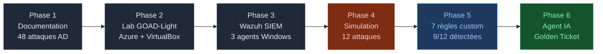

<h1 align="center">Active Directory Attack Detection</h1>
<p align="center">Wazuh SIEM · Règles custom · Agent IA (Isolation Forest)</p>

---

**Projet de stage — SOC Dataprotect — Juillet–Août 2026**
**Auteurs :** Maimouni Mohammed & Chafak Othmane
**Encadrant entreprise :** Benkirane Abbes · **Encadrant école :** Bakkaliyeddi Othman

---

## En deux phrases

Ce projet répond à une question concrète posée par le SOC de Dataprotect :
**un SIEM Wazuh installé par défaut peut-il détecter les attaques Active Directory avancées — et sinon, comment combler les angles morts ?**

La réponse : non, Wazuh par défaut ne détecte que **2 attaques sur 12**. Ce projet monte ce score à **9/12 par des règles custom**, puis couvre le reste par un **agent IA (Isolation Forest)** capable de détecter le Golden Ticket — une attaque indétectable par toute règle de signature.

---

## Lire ce dépôt

Le projet se déroule en 6 phases. Chaque dossier correspond à une phase. Lisez dans l'ordre si vous découvrez le projet, ou allez directement à la phase qui vous intéresse.

| Dossier | Phase | Contenu | Lire si vous voulez... |
|---------|-------|---------|----------------------|
| [1-documentation/](1-documentation/) | Phase 1 | 48 fiches d'attaques AD (MITRE ATT&CK) | Comprendre les techniques avant de les voir en action |
| [2-lab/](2-lab/) | Phase 2 | Déploiement GOAD-Light sur Azure | Reproduire le lab ou comprendre l'infrastructure |
| [3-siem/](3-siem/) | Phase 3 | Installation Wazuh + configuration des audits | Brancher un SIEM sur un lab AD |
| [4-attacks/](4-attacks/) | Phase 4 | 12 playbooks d'attaque + résultats Wazuh | Voir ce que Wazuh détecte (ou rate) pour chaque attaque |
| [5-detection/](5-detection/) | Phase 5 | 7 règles Wazuh custom validées en live | Déployer les règles ou comprendre comment elles fonctionnent |
| [6-ai-agent/](6-ai-agent/) | Phase 6 | Agent Isolation Forest + script Python | Comprendre ou relancer l'agent de détection comportementale |
| [reports/](reports/) | — | Rapport de stage officiel | Lire le rapport complet |

---

## Flux du projet



---

## Résultats en un coup d'oeil

### Détection par attaque

| # | Attaque | MITRE | Wazuh défaut | Après règles (Phase 5) | Agent IA (Phase 6) |
|:-:|---------|-------|:------------:|:----------------------:|:-----------------:|
| 01 | [Kerberoasting](4-attacks/playbooks/01-kerberoasting.md) | T1558.003 | Partiel | Détecté (règle 100011) | — |
| 02 | [AS-REP Roasting](4-attacks/playbooks/02-asrep-roasting.md) | T1558.004 | Invisible | Détecté (règle 100014) | — |
| 03 | [Énumération LDAP](4-attacks/playbooks/03-enumeration.md) | T1087 | Invisible | Invisible (structurel) | — |
| 04 | [LLMNR Poisoning](4-attacks/playbooks/04-llmnr-poisoning.md) | T1557.001 | Invisible | Invisible (réseau) | — |
| 05 | [Password Spraying](4-attacks/playbooks/05-password-spraying.md) | T1110.003 | Détecté | Détecté | — |
| 06 | [DCSync](4-attacks/playbooks/06-dcsync.md) | T1003.006 | Invisible | Détecté (règle 100010) | — |
| 07 | [Abus d'ACL](4-attacks/playbooks/07-acl-abuse.md) | T1222 | Détecté | Détecté | — |
| 08 | [ADCS ESC1](4-attacks/playbooks/08-adcs-esc1.md) | T1649 | Invisible | Détecté (règle 100012) | — |
| 09 | [Pass-the-Hash](4-attacks/playbooks/09-pass-the-hash.md) | T1550.002 | Partiel | Détecté (règle 100017) | — |
| 10 | [MSSQL RCE](4-attacks/playbooks/10-mssql-rce.md) | T1210 | Invisible | Détecté (règle 100013) | — |
| 11 | [Golden Ticket](4-attacks/playbooks/11-golden-ticket.md) | T1558.001 | Partiel | Impossible (pas de signature) | **Détecté** |
| 12 | [Trust inter-domaine](4-attacks/playbooks/12-trust-inter-domaine.md) | T1482 | Partiel | Détecté (règle 100019) | — |

**Score Wazuh par défaut : 2/12 — Après Phase 5 : 9/12 — Golden Ticket couvert par l'IA**

### Règles Wazuh custom

| Règle | Attaque ciblée | Event Windows | Résultat live |
|:-----:|----------------|:-------------:|--------------|
| [100010](5-detection/rules/local_rules.xml) | DCSync | 4662 | 3 hits — tywin.lannister identifié |
| [100011](5-detection/rules/local_rules.xml) | Kerberoasting | 4769 + RC4 | 3 hits — rafale RC4 détectée |
| [100012](5-detection/rules/local_rules.xml) | ADCS ESC1 | 4887 | 2 hits — certificat Administrator |
| [100013](5-detection/rules/local_rules.xml) | MSSQL RCE | 4688 | 7 hits — cmd.exe issu de sqlservr.exe |
| [100014](5-detection/rules/local_rules.xml) | AS-REP Roasting | 4768 | 1 hit — compte sans pré-authentification |
| [100017](5-detection/rules/local_rules.xml) | Pass-the-Hash | 4624 + NTLM | 5 hits — logon NTLM réseau |
| [100019](5-detection/rules/local_rules.xml) | Trust Abuse | 4624 cross-domain | 18 hits — NORTH vers SEVENKINGDOMS |

### Agent IA — Top anomalies (23 comptes, 18 août 2026)

| Compte | Score | Signal détecté | Interprétation |
|--------|:-----:|----------------|----------------|
| robb.stark | -0.170 | 1 461 événements/24h | Bot RDP automatisé |
| eddard.stark | -0.086 | 17 logons NTLM | Pass-the-Hash |
| robb.stark@NORTH | -0.083 | **610 TGS sans aucun TGT** | **Golden Ticket** |
| sql_svc | -0.022 | Alertes xp_cmdshell | MSSQL RCE |

Le compte `robb.stark@NORTH` a effectué 610 demandes de tickets TGS sans jamais avoir demandé un TGT. C'est physiquement impossible dans un flux Kerberos légitime — c'est la signature comportementale exclusive d'un Golden Ticket forgé hors ligne.

---

## Architecture du lab

> Lab Active Directory vulnérable (GOAD-Light) déployé sur une VM Linux Azure avec virtualisation imbriquée (VirtualBox).

```
  VM Azure Linux · Ubuntu 24.04 · Standard_E4s_v3 · 4 vCPU / 32 Go RAM
  +---------------------------------------------------------------------+
  |                           VirtualBox                                 |
  |                                                                      |
  |  +----------------+   +----------------+   +--------------------+   |
  |  |      DC01      |   |      DC02      |   |        SRV02       |   |
  |  |  kingslanding  |   |  winterfell    |   |    castelblack     |   |
  |  |      .10       |   |      .11       |   |    .22 · MSSQL     |   |
  |  +-------+--------+   +-------+--------+   +---------+----------+   |
  |          | Wazuh agent        | Wazuh agent           | Wazuh agent  |
  |          +--------------------+-----------------------+              |
  |                         +-----+------+                               |
  |                         | Wazuh .51  | SIEM — logs · règles · UI    |
  |                         +------------+                               |
  |                Réseau host-only · 192.168.56.0/24                   |
  +---------------------------------------------------------------------+
                    SSH + tunnel depuis le PC local
```

| Machine | IP | Rôle | Domaine |
|---------|:--:|------|---------|
| `kingslanding` | .10 | Contrôleur de domaine principal (DC01) | `sevenkingdoms.local` |
| `winterfell` | .11 | Contrôleur de domaine enfant (DC02) | `north.sevenkingdoms.local` |
| `castelblack` | .22 | Serveur membre + MSSQL Server | `north.sevenkingdoms.local` |
| `wazuh` | .51 | SIEM — indexer + manager + dashboard | — |

Les deux domaines sont reliés par un trust parent-enfant pour simuler les attaques inter-domaines.

---

## Démarrage rapide

**Je veux reproduire le lab :**
1. Lire [2-lab/setup/01-azure-vm.md](2-lab/setup/01-azure-vm.md)
2. Lancer [2-lab/setup/azure-goad-setup.sh](2-lab/setup/azure-goad-setup.sh)
3. Suivre [3-siem/setup/01-wazuh-server.md](3-siem/setup/01-wazuh-server.md)

**Je veux déployer les règles de détection :**
1. Copier [5-detection/rules/local_rules.xml](5-detection/rules/local_rules.xml) dans `/var/ossec/etc/rules/`
2. Relancer le manager : `systemctl restart wazuh-manager`

**Je veux lancer l'agent IA :**
```bash
cd 6-ai-agent/
pip install -r requirements.txt
python anomaly_detection.py /chemin/vers/alertes_wazuh.json
```

---

## Stack technique

| Couche | Technologie |
|--------|------------|
| Lab AD vulnérable | GOAD-Light — VirtualBox, Vagrant, Ansible |
| Infrastructure | Microsoft Azure — VM Linux, virtualisation imbriquée |
| SIEM | Wazuh — indexer (OpenSearch), manager, dashboard, agents Windows |
| Outils offensifs | impacket, Certipy, bloodhound-python, evil-winrm, kerbrute, Responder |
| Agent IA | Python 3 — scikit-learn, pandas, numpy |
| Référentiel | MITRE ATT&CK Enterprise |

---

## Cadre éthique

Toutes les attaques ont été réalisées exclusivement dans un environnement isolé et volontairement vulnérable (GOAD-Light), à des fins de recherche défensive et d'enseignement. Aucune de ces techniques ne doit être utilisée sur un système réel sans autorisation écrite explicite.
