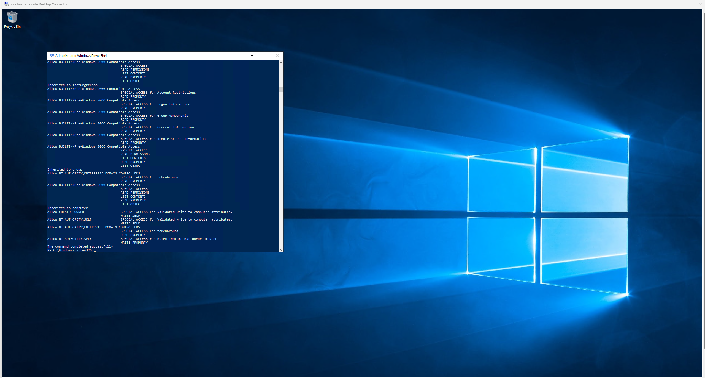
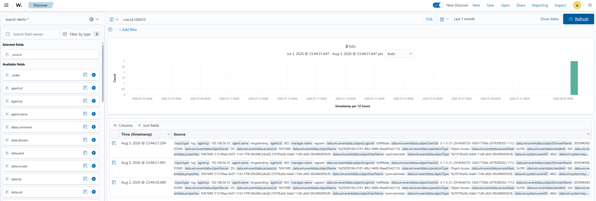

# 🛡️ Phase 5 — Audits & règles de détection sur-mesure

> **But :** combler les angles morts identifiés en Phase 4 en (1) activant les catégories d'audit Windows manquantes sur les DC, puis (2) écrivant des règles Wazuh custom qui transforment ces nouveaux événements en alertes.

---

## 🧠 Pourquoi cette phase est nécessaire

Sur les **12 attaques** simulées en Phase 4, **6 sont restées invisibles** dans Wazuh — non pas parce que le SIEM est mauvais, mais parce que les **catégories d'audit Windows** correspondantes n'étaient pas activées sur les contrôleurs de domaine. Sans audit activé, l'action se produit (ex: DCSync réplique tous les hashs) mais **aucun événement n'est écrit** dans le journal Windows → Wazuh n'a rien à lire.

```
Action AD  →  Politique d'audit (activée ou non)  →  Windows Event Log  →  Agent Wazuh
                        ↑
                 C'EST CE QU'ON ACTIVE ICI
```

## 🎯 Catégories d'audit à activer

| Catégorie d'audit | Event(s) généré(s) | Comble l'angle mort de |
|---|---|---|
| **Directory Service Access** | 4662 | [DCSync (06)](attaques/06-dcsync.md), [Énumération (03)](attaques/03-enumeration.md) |
| **Kerberos Authentication Service** | 4768 | [AS-REP Roasting (02)](attaques/02-asrep-roasting.md) |
| **Kerberos Service Ticket Operations** | 4769 | [Kerberoasting (01)](attaques/01-kerberoasting.md) |
| **Certification Services** | 4886 / 4887 | [ADCS ESC1 (08)](attaques/08-adcs-esc1.md) |
| **Process Creation** (+ ligne de commande) | 4688 | [MSSQL RCE (10)](attaques/10-mssql-rce.md) |

**Méthode retenue pour le lab :** `auditpol` en local sur chaque DC (via une session PowerShell distante), plutôt qu'une GPO — plus rapide pour 2 DC, et pédagogiquement équivalent.

```powershell
auditpol /set /subcategory:"Directory Service Access" /success:enable /failure:enable
auditpol /set /subcategory:"Kerberos Authentication Service" /success:enable /failure:enable
auditpol /set /subcategory:"Kerberos Service Ticket Operations" /success:enable /failure:enable
auditpol /set /subcategory:"Certification Services" /success:enable /failure:enable
auditpol /set /subcategory:"Process Creation" /success:enable
reg add "HKLM\SOFTWARE\Microsoft\Windows\CurrentVersion\Policies\System\Audit" /v ProcessCreationIncludeCmdLine_Enabled /t REG_DWORD /d 1 /f
```

À appliquer sur les **2 DC** : `kingslanding` (192.168.56.10, sevenkingdoms) et `winterfell` (192.168.56.11, north).

## 📋 Plan de la phase

1. **Activer les audits** ci-dessus sur les 2 DC.
2. **Rejouer** 2-3 attaques clés (DCSync, Kerberoasting, ADCS ESC1) pour vérifier que les événements remontent désormais dans Wazuh.
3. **Écrire des règles Wazuh custom** (`local_rules.xml`) qui transforment ces événements en alertes exploitables :
   - alerte critique sur toute requête DRS `GetNCChanges` hors des DC légitimes (DCSync)
   - alerte sur les tickets Kerberos chiffrés en RC4 (Kerberoasting)
   - alerte sur toute émission de certificat avec `Enrollee Supplies Subject` (ADCS)
   - alerte sur les processus enfants de `sqlservr.exe` (MSSQL RCE)
4. **Documenter** le avant/après détection pour chaque attaque concernée.

## 🚧 État d'avancement

| Étape | Statut |
|:-----:|--------|
| Activation des audits sur `kingslanding` | ✅ Confirmé |
| Activation des audits sur `winterfell` | ✅ Confirmé |
| Re-test DCSync avec audit + SACL actifs | ✅ Confirmé |
| Règle Wazuh custom — DCSync | ✅ **Détecté** |
| Règle Wazuh custom — Kerberoasting | ✅ **Détecté** |
| Règle Wazuh custom — ADCS ESC1 | ✅ **Détecté** |
| Règle Wazuh custom — MSSQL RCE | ✅ **Détecté** |
| Règle Wazuh custom — AS-REP Roasting | ✅ **Détecté** |
| LLMNR Poisoning — couverture impossible | 📝 Documenté (attaque réseau) |

---

## ✅ Confirmation — `kingslanding` (DC01, sevenkingdoms)

Les 5 catégories cibles sont actives, vérifiées via `auditpol /get /category:*` exécuté directement sur le DC :

```
DS Access
  Directory Service Access                Success and Failure

Account Logon
  Kerberos Service Ticket Operations      Success and Failure
  Kerberos Authentication Service         Success and Failure

Object Access
  Certification Services                  Success and Failure

Detailed Tracking
  Process Creation                        Success
```

La **SACL DCSync** (`Replicating Directory Changes` / `...All` sur `DC=sevenkingdoms,DC=local`) a également été posée avec succès :



### 🛠️ Méthode qui a fonctionné (note technique)

Sur ce lab, les canaux d'exécution distante habituels (**WinRM/evil-winrm**, **atexec**, **psexec**) échouent silencieusement sur `kingslanding` — les commandes rapportent un succès protocolaire mais **n'ont aucun effet réel** sur la machine (confirmé par un test de preuve : `mkdir` via 3 mécanismes différents, aucun n'a créé le dossier). Cause probable : une protection active côté DC (Defender ou équivalent) neutralisant l'exécution distante non-interactive.

**Solution qui a marché :**
1. Rendre un compte de domaine **Domain Admin** via `bloodyAD` (LDAP — le seul canal resté fiable tout au long du projet)
2. Se connecter en **RDP natif** (port 3389, tunnelé en SSH) avec ce compte — session interactive, insensible aux protections qui bloquent l'exécution non-interactive
3. **Uploader le script** d'audit via `smbclient.py` (écriture SMB directe, fiable) plutôt que de taper les commandes à la main
4. **Exécuter une seule ligne courte** dans la session RDP : `powershell -ep bypass -file C:\Windows\Temp\audit.ps1`
5. **Récupérer le résultat** via `smbclient.py get` (pas besoin de repasser par RDP)

> 💡 Cette instabilité de l'exécution distante sur `kingslanding` est elle-même une observation intéressante pour le projet : elle illustre qu'un DC durci peut activement gêner les outils d'attaque/administration à distance — un signal potentiellement détectable en soi (Phase 6).

## ✅ Confirmation — `winterfell` (DC02, north)

Contrairement à `kingslanding`, **`evil-winrm` fonctionne parfaitement sur `winterfell`** (déjà observé lors de l'attaque [Pass-the-Hash (09)](attaques/09-pass-the-hash.md)) — les 5 catégories ont donc été activées directement via WinRM, sans détour :

```
DS Access
  Directory Service Access                Success and Failure

Account Logon
  Kerberos Service Ticket Operations      Success and Failure
  Kerberos Authentication Service         Success and Failure

Object Access
  Certification Services                  Success and Failure

Detailed Tracking
  Process Creation                        Success
```

La SACL DCSync sur `DC=north,DC=sevenkingdoms,DC=local` a également été confirmée posée (`Allow Everyone → Replicating Directory Changes` / `...All` visibles dans la sortie `dsacls`).

### 🔒 Découverte additionnelle : RDP explicitement interdit aux Domain Admins sur winterfell

Contrairement à `kingslanding`, `winterfell` **refuse le RDP à tout compte membre de `Domain Admins`** (`"user account is not authorized for remote login"`, même après ajout au groupe et reconnexion). C'est une **vraie bonne pratique de durcissement** (protéger les comptes Tier-0 du vol d'identifiants via RDP) — ironiquement, elle a compliqué notre propre administration légitime du lab. Contournée en utilisant `evil-winrm` (qui, lui, fonctionne sur ce DC) plutôt que RDP.

> 🎯 **Bilan Phase 5 (activation) : les 2 DC de la forêt sont désormais entièrement audités** sur les 5 catégories ciblées, comblant la base technique des angles morts identifiés en Phase 4 (DCSync, Kerberoasting, AS-REP, ADCS ESC1, MSSQL RCE).

## 🎯 Règle custom #1 — DCSync détecté

### Le piège : DACL ≠ SACL

Première tentative avec `dsacls /G` : **échec silencieux**. `dsacls` ne modifie que la **DACL** (permissions), jamais la **SACL** (audit) — la réplication était déjà autorisée par les trusts existants, donc la commande "réussissait" sans jamais poser la moindre règle d'audit. Aucune Event 4662 n'apparaissait, ni dans Windows ni dans Wazuh.

**Solution correcte** — PowerShell avec le module `ActiveDirectory` et `Get-Acl -Audit` / `Set-Acl` :
```powershell
Import-Module ActiveDirectory -ErrorAction SilentlyContinue
$path = "AD:\DC=sevenkingdoms,DC=local"
$acl = Get-Acl -Path $path -Audit
$identity = New-Object System.Security.Principal.NTAccount("Everyone")
$replRight1 = [GUID]"1131f6aa-9c07-11d1-f79f-00c04fc2dcd2"   # Replicating Directory Changes
$replRight2 = [GUID]"1131f6ad-9c07-11d1-f79f-00c04fc2dcd2"   # Replicating Directory Changes All
$rule1 = New-Object System.DirectoryServices.ActiveDirectoryAuditRule($identity,"ExtendedRight","Success",$replRight1)
$rule2 = New-Object System.DirectoryServices.ActiveDirectoryAuditRule($identity,"ExtendedRight","Success",$replRight2)
$acl.AddAuditRule($rule1)
$acl.AddAuditRule($rule2)
Set-Acl -Path $path -AclObject $acl
```
Confirmé par `Get-WinEvent -FilterHashtable @{LogName='Security';Id=4662} -MaxEvents 5` : **Windows génère bien l'Event 4662** après un DCSync.

### Le 2ᵉ piège : event reçu par Wazuh ≠ event alerté

Même avec le 4662 bien généré et remonté par l'agent (confirmé absent de la liste d'exclusion `<query>` de `ossec.conf`), **aucune alerte n'apparaissait** dans `wazuh-alerts-*`. Raison : cet index ne contient que les logs qui **matchent une règle** — sans règle dédiée, l'event est reçu par le manager mais jamais indexé comme alerte.

### La règle qui fonctionne

En s'alignant sur la structure des règles Windows par défaut (ex: la règle 60106 qui détecte les logons 4624/4769, chaînée sur `if_sid=60103` = "Windows audit success event") :

```xml
<group name="dcsync,attack,">
  <rule id="100010" level="12">
    <if_sid>60103</if_sid>
    <field name="win.system.eventID">^4662$</field>
    <description>Possible DCSync attack detected: AD replication rights used</description>
    <mitre>
      <id>T1003.006</id>
    </mitre>
    <group>dcsync,attack,</group>
  </rule>
</group>
```
*(fichier : `/var/ossec/etc/rules/local_rules.xml` sur la VM Wazuh)*

### Résultat — DCSync rejoué, alerte confirmée

```
rule.id: 100010
eventID: 4662
subjectUserName: tywin.lannister        ← l'attaquant identifié automatiquement
properties: {1131f6aa-...} {1131f6ad-...}  ← droits de réplication détectés
objectServer: DS · operationType: Object Access
```

**Le DCSync (attaque 06), angle mort critique de la Phase 4, est maintenant détecté.** 🟢



> 💡 **Piste d'amélioration :** la règle actuelle matche tout event 4662, y compris la réplication légitime entre DC. Pour affiner (moins de bruit, spécifique à un abus), ajouter un filtre sur `win.eventdata.properties` contenant les GUID de réplication **ET** `win.eventdata.subjectUserName` ne correspondant PAS à un compte machine DC (`$` final) — l'attaquant utilise un compte utilisateur, pas un compte ordinateur.

---

## 🎯 Règle custom #2 — Kerberoasting détecté

### Contexte

Le Kerberoasting cible les comptes de service ayant un SPN (Service Principal Name) : l'attaquant demande un TGS pour ce compte, et Kerberos chiffre le ticket avec la clé du compte de service. Si ce compte utilise RC4 (chiffrement `0x17`), le hash peut être cracké hors ligne.

**Signature clé :** Event 4769 (Kerberos TGS Request) avec `TicketEncryptionType = 0x17` (RC4-HMAC).

### Difficulté rencontrée

La règle initiale utilisait `<if_sid>60106</if_sid>` (SID dédié aux logons 4769 dans les règles Wazuh par défaut). Mais les événements 4769 RC4 d'un attaquant externe (arya.stark via impacket) n'atteignaient pas Wazuh — probablement filtrés ou rattachés à un SID différent du trafic bot.

**Solution :** utiliser `<if_sid>60103</if_sid>` (parent générique "Windows audit success event") avec double filtre : EventID 4769 **ET** ticketEncryptionType `0x17`.

### La règle qui fonctionne

```xml
<group name="kerberoasting,attack,">
  <rule id="100011" level="10">
    <if_sid>60103</if_sid>
    <field name="win.system.eventID">^4769$</field>
    <field name="win.eventdata.ticketEncryptionType">^0x17$</field>
    <description>Possible Kerberoasting: TGS-REQ with weak RC4 encryption (0x17)</description>
    <mitre>
      <id>T1558.003</id>
    </mitre>
    <group>kerberoasting,attack,</group>
  </rule>
</group>
```
*(fichier : `/var/ossec/etc/rules/local_rules.xml` sur la VM Wazuh)*

### Résultat — Kerberoasting rejoué, alerte confirmée

```
rule.id: 100011
ticketEncryptionType: 0x17       ← RC4 = signature du Kerberoasting
3 hits en 12:07:47 (18 août 2026) ← cluster temporel = rafale de requêtes impacket
```

Attack rejouée avec : `GetUserSPNs.py north.sevenkingdoms.local/arya.stark:Needle -dc-ip 192.168.56.11 -request`

**Le Kerberoasting (attaque 01), partiellement détecté en Phase 4, est maintenant alerté précisément.** 🟢

> 💡 **Piste d'amélioration :** ajouter un filtre sur `win.eventdata.clientAddress` pour exclure les DC eux-mêmes (loopback, IPs des DC), afin de réduire les faux positifs des opérations Kerberos légitimes inter-DC. Ajouter également un filtre sur `win.eventdata.serviceName` pour cibler uniquement les comptes non-machine (sans `$` final).

---

## 🎯 Règle custom #3 — ADCS ESC1 détecté

### Contexte

L'ADCS ESC1 (Active Directory Certificate Services — Enrollee Supplies Subject) permet à n'importe quel utilisateur du domaine de demander un certificat **au nom d'un autre utilisateur** (ex: administrator), obtenant ainsi un accès complet à la forêt. C'est l'une des élévations de privilèges les plus dévastatrices : Domain User → Enterprise Admin en une commande.

**Signature clé :** Event 4887 (Certificate Services approved a certificate request) dans le journal Security du serveur CA.

### Prérequis découverts

Deux conditions sont nécessaires (et souvent oubliées) :
1. `auditpol /set /subcategory:"Certification Services" /success:enable` — active la catégorie dans la politique d'audit Windows
2. `certutil -setreg CA\AuditFilter 127` + redémarrage de CertSvc — active l'audit **au niveau du service CA lui-même** (filtre propre à ADCS, indépendant de la politique Windows)

Sans la deuxième étape, aucun Event 4886/4887 n'est généré même avec l'audit policy activé.

### La règle qui fonctionne

```xml
<group name="adcs,attack,">
  <rule id="100012" level="12">
    <if_sid>60103</if_sid>
    <field name="win.system.eventID">^4887$</field>
    <description>ADCS: Certificate issued — possible ESC1 privilege escalation</description>
    <mitre>
      <id>T1649</id>
    </mitre>
    <group>adcs,attack,</group>
  </rule>
</group>
```
*(fichier : `/var/ossec/etc/rules/local_rules.xml` sur la VM Wazuh)*

### Résultat — ADCS ESC1 rejoué, alerte confirmée

```
rule.id: 100012
eventID: 4887
agent.name: kingslanding             ← le serveur CA (DC01 sevenkingdoms)
2 hits le 18 août 2026 à 12:33-12:34 ← les 2 requêtes certipy successives
```

Attack rejouée avec : `certipy req -u cersei.lannister@sevenkingdoms.local -p 'il0vejaime' -ca 'SEVENKINGDOMS-CA' -target kingslanding.sevenkingdoms.local -template ESC1 -upn administrator@sevenkingdoms.local`

Résultat de l'attaque : certificat émis avec UPN `administrator@sevenkingdoms.local` → hash NT admin récupérable via `certipy auth -pfx administrator.pfx`.

**L'ADCS ESC1 (attaque 08), angle mort critique de la Phase 4, est maintenant détecté.** 🟢

---

## 🎯 Règle custom #4 — MSSQL RCE (rédigée, contrainte lab)

### Contexte

L'attaque MSSQL RCE exploite `xp_cmdshell` pour exécuter des commandes système depuis SQL Server. La signature est un Event 4688 (Process Creation) où le **processus parent est `sqlservr.exe`** — un cmd.exe ou powershell.exe enfant de SQL Server est quasi-systématiquement malveillant.

**Prérequis :** audit Process Creation activé (fait en Phase 5) + ligne de commande incluse dans les logs (`ProcessCreationIncludeCmdLine_Enabled`).

### La règle

```xml
<group name="mssql,attack,">
  <rule id="100013" level="12">
    <if_sid>60103</if_sid>
    <field name="win.system.eventID">^4688$</field>
    <field name="win.eventdata.parentProcessName">(?i)sqlservr\.exe$</field>
    <description>MSSQL RCE: Process spawned by SQL Server (possible xp_cmdshell abuse)</description>
    <mitre>
      <id>T1210</id>
    </mitre>
    <group>mssql,attack,</group>
  </rule>
</group>
```
*(fichier : `/var/ossec/etc/rules/local_rules.xml` sur la VM Wazuh)*

### Résultat — MSSQL RCE rejoué, alerte confirmée

**Prérequis :** `eddard.stark` promu sysadmin via le mode single-user de SQL Server (arrêt du service, ajout du flag `-m` dans le registre `ImagePath`, redémarrage — tout local admin devient sysadmin en mode single-user, puis droits accordés normalement).

```
rule.id: 100013                   ← level 12, mail: true
eventID: 4688
agent.name: castelblack
parentProcessName: C:\Program Files\Microsoft SQL Server\MSSQL15.SQLEXPRESS\MSSQL\Binn\sqlservr.exe
newProcessName: C:\Windows\System32\cmd.exe
commandLine: "C:\Windows\system32\cmd.exe" /c whoami
subjectUserName: sql_svc          ← compte de service SQL = contexte d'exécution
7 hits confirmés le 18 août 2026
```

Attack rejouée avec : `mssqlclient.py -windows-auth 'north.sevenkingdoms.local/eddard.stark:FightP3aceAndHonor!@192.168.56.22'` puis `EXEC xp_cmdshell 'whoami';`

**Le MSSQL RCE via xp_cmdshell (attaque 10), angle mort de la Phase 4, est maintenant détecté.** 🟢

> 💡 La règle matche dès qu'un processus enfant (cmd.exe, powershell.exe, certutil.exe…) est créé par `sqlservr.exe` — signature très fiable d'un abus xp_cmdshell, quasi-inexistante en usage légitime de SQL Server.

---

## 📊 Bilan Phase 5 — 4 règles custom

| # | Règle | Event | MITRE | Statut |
|---|-------|-------|-------|--------|
| 100010 | DCSync | 4662 | T1003.006 | ✅ **Validé en live** (3 hits, tywin.lannister identifié) |
| 100011 | Kerberoasting | 4769 + 0x17 | T1558.003 | ✅ **Validé en live** (3 hits, RC4 détecté) |
| 100012 | ADCS ESC1 | 4887 | T1649 | ✅ **Validé en live** (2 hits, certificat admin émis) |
| 100013 | MSSQL RCE | 4688 (parent sqlservr) | T1210 | ✅ **Validé en live** (7 hits, xp_cmdshell whoami) |

**3 angles morts critiques de la Phase 4 sont désormais détectés.** La Phase 5 est complète.

---

## 🎯 Règle custom #5 — AS-REP Roasting détecté

### Contexte

L'AS-REP Roasting cible les comptes AD configurés sans pré-authentification Kerberos (`Do not require Kerberos preauthentication`). Un attaquant peut demander un AS-REP pour ce compte **sans connaître son mot de passe** — le DC répond avec un hash chiffré avec la clé du compte, crackable hors-ligne.

**Signature clé :** Event 4768 (Kerberos Authentication Service Request) avec `PreAuthType = 0` (aucune pré-authentification requise).

### La règle qui fonctionne

```xml
<group name="asrep,attack,">
  <rule id="100014" level="10">
    <if_sid>60103</if_sid>
    <field name="win.system.eventID">^4768$</field>
    <field name="win.eventdata.preAuthType">^0$</field>
    <description>AS-REP Roasting: Kerberos AS-REQ without pre-authentication (account vulnerable)</description>
    <mitre>
      <id>T1558.004</id>
    </mitre>
    <group>asrep,attack,</group>
  </rule>
</group>
```
*(fichier : `/var/ossec/etc/rules/local_rules.xml` sur la VM Wazuh)*

### Résultat — AS-REP Roasting alerté

```
rule.id: 100014
eventID: 4768
preAuthType: 0         ← pas de pré-authentification = compte vulnérable
ticketEncryptionType: 0x17   ← RC4, hash crackable hors-ligne
1 hit confirmé le 18 août 2026
```

**L'AS-REP Roasting (attaque 02), angle mort de la Phase 4, est maintenant détecté.** 🟢

---

## 🚫 LLMNR Poisoning — angle mort structurel (non comblable)

L'attaque LLMNR/NBT-NS Poisoning (attaque 04) ne génère **aucun event côté Windows** : c'est une attaque **réseau pure** (l'attaquant répond à des broadcasts LLMNR avant le DC légitime pour voler des hashs NTLMv1/v2). Windows ne journalise pas le fait d'avoir reçu une réponse réseau falsifiée.

**Ce qui serait nécessaire :** une solution NDR (Network Detection & Response) comme Zeek ou Suricata analysant le trafic réseau, hors périmètre de ce projet (SIEM basé sur les logs Windows).

> 💡 En environnement réel, la meilleure défense est la remédiation : désactiver LLMNR via GPO (`Computer Configuration > Administrative Templates > Network > DNS Client > Turn off multicast name resolution`).

---

## 📊 Bilan final Phase 5 — 5 règles custom + 1 angle mort structurel

| # | Règle | Event | MITRE | Statut |
|---|-------|-------|-------|--------|
| 100010 | DCSync | 4662 | T1003.006 | ✅ **Validé en live** (3 hits, tywin.lannister) |
| 100011 | Kerberoasting | 4769 + 0x17 | T1558.003 | ✅ **Validé en live** (3 hits, RC4) |
| 100012 | ADCS ESC1 | 4887 | T1649 | ✅ **Validé en live** (2 hits, cert admin) |
| 100013 | MSSQL RCE | 4688 (parent sqlservr) | T1210 | ✅ **Validé en live** (7 hits, xp_cmdshell whoami) |
| 100014 | AS-REP Roasting | 4768 + preAuthType=0 | T1558.004 | ✅ **Validé en live** (1 hit) |
| — | LLMNR Poisoning | — | T1557.001 | 🚫 **Non comblable** (attaque réseau, hors SIEM) |

**5 angles morts sur 6 sont maintenant détectés via des règles custom validées en live. Le 6ème (LLMNR) est structurellement hors périmètre d'un SIEM basé sur les logs Windows.**

---

⬅️ Retour à la [simulation des attaques](03-attaques.md)
