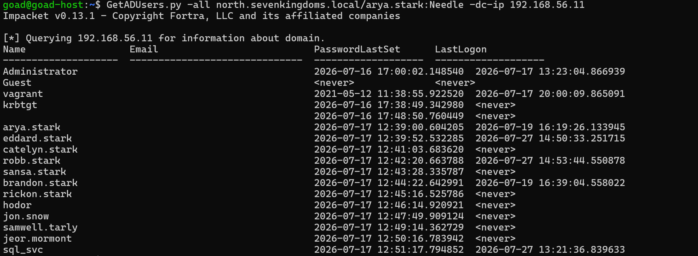
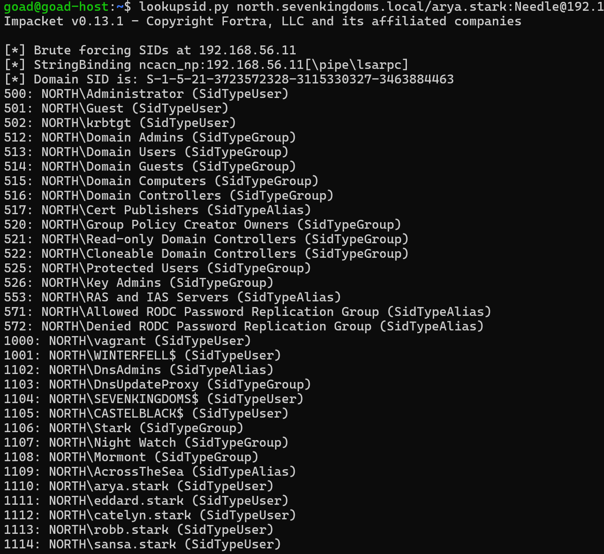
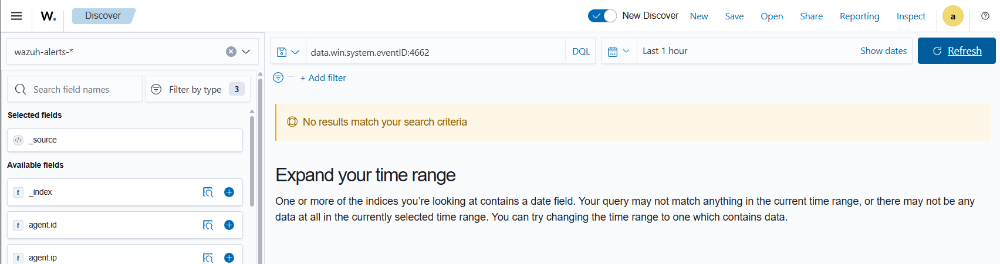

# ⚔️ Attaque 03 — Énumération (Reconnaissance)

| | |
|---|---|
| **Catégorie** | Recon / Discovery |
| **MITRE ATT&CK** | [T1087.002](https://attack.mitre.org/techniques/T1087/002/) |
| **Fiche théorique** | [`../../docs/01-recon/01-ldap-enumeration.md`](../../docs/01-recon/01-ldap-enumeration.md) |
| **Cible** | `north.sevenkingdoms.local` (DC02 / winterfell · 192.168.56.11) |
| **Compte attaquant** | `arya.stark` (utilisateur basique) |
| **Outil** | impacket — `GetADUsers.py`, `lookupsid.py` |
| **Statut détection Wazuh** | 🔴 Angle mort (énumération LDAP non auditée) |

---

## 1. 🧠 Description
Avant d'attaquer, un pirate fait de la **reconnaissance** : il liste les **utilisateurs, groupes et machines** du domaine pour repérer ses cibles (comptes admin, comptes de service, comptes faibles, groupes privilégiés). C'est **la 1ʳᵉ étape de toute intrusion** — on cartographie le terrain.

## 2. 🎯 Prérequis
- **Un compte de domaine valide** (même sans privilège), ici `arya.stark`.
- Accès réseau LDAP/SMB au contrôleur de domaine.

## 3. 💻 Exécution

### a) Lister tous les utilisateurs (LDAP)
```bash
GetADUsers.py -all north.sevenkingdoms.local/arya.stark:Needle -dc-ip 192.168.56.11
```
→ nom, email, dernière connexion, dernier changement de mot de passe de chaque compte.



### b) RID cycling (énumère users + groupes + machines)
```bash
lookupsid.py north.sevenkingdoms.local/arya.stark:Needle@192.168.56.11
```
→ le **SID du domaine** + tous les objets par RID : `Domain Admins` (512), comptes machine (`WINTERFELL$`, `CASTELBLACK$`), groupes custom (`Stark`, `Night Watch`, `Mormont`)…



## 4. 📤 Résultat
Cartographie complète du domaine : **liste des comptes**, **groupes privilégiés** (Domain Admins…), **comptes machine**, et le **SID du domaine** (`S-1-5-21-3723572328-3115330327-3463884463`, réutilisé ensuite pour le [Golden Ticket](11-golden-ticket.md)). C'est la base de tout ciblage ultérieur.

## 5. 🛡️ Détection dans Wazuh — 🔴 angle mort
**Recherche (Threat Hunting → Events) :**
```
data.win.system.eventID:4662
```
**Résultat : `No results`.** L'énumération LDAP **ne remonte pas** à Wazuh (audit *Directory Service Access* non activé) et **ressemble de toute façon à du trafic applicatif normal**.



## 6. 🎓 Analyse & leçon
> **La reconnaissance est furtive.** Un compte lambda qui interroge l'annuaire est indiscernable d'une application légitime, et sans audit dédié, il ne laisse aucune trace. → La détection demande d'activer l'audit LDAP/DS-Access **et** de repérer des **volumes/patterns anormaux** de requêtes (comportemental / Phase 6).

## 7. 🔧 Remédiation
- Activer l'audit *Directory Service Access* et surveiller les **énumérations massives** (RID cycling, requêtes LDAP volumineuses).
- Limiter les informations lisibles par les comptes standards.
- Détecter les outils de recon (BloodHound, RID cycling) par leurs patterns (comportemental).

---

⬅️ Retour à l'[index des attaques](../03-attaques.md)
