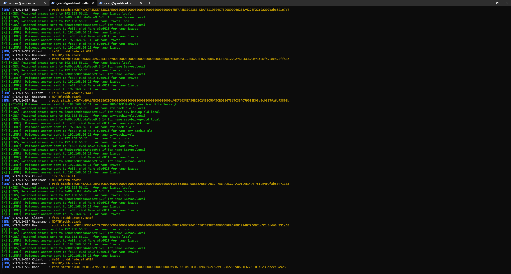
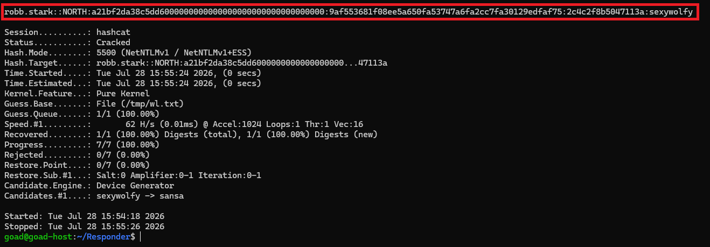
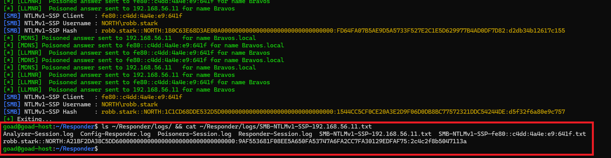
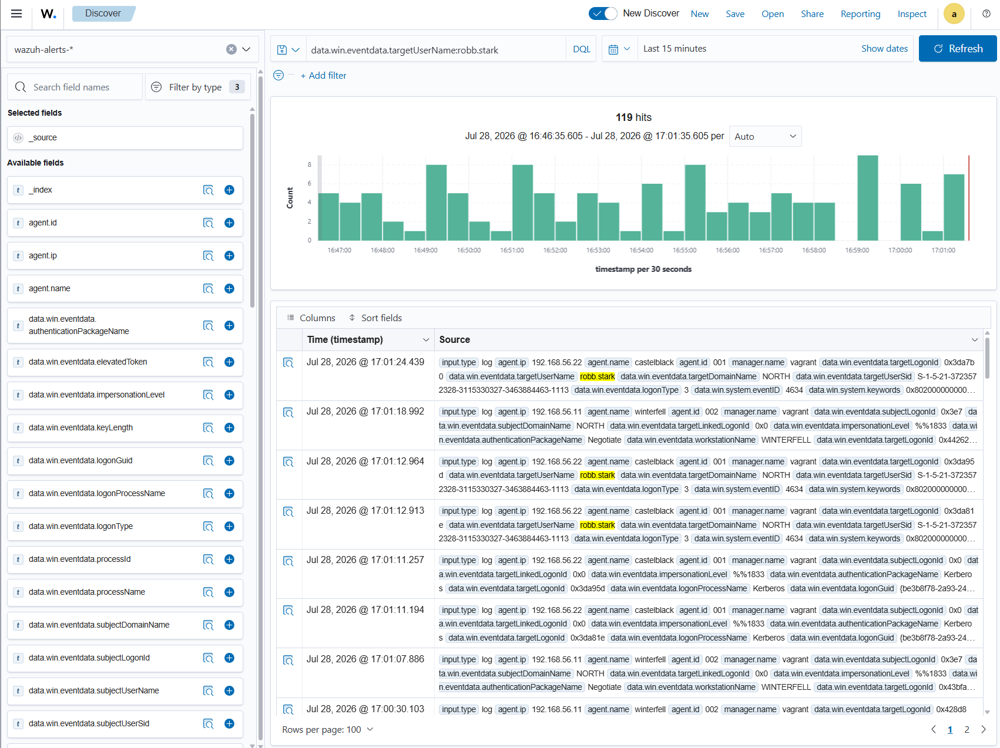
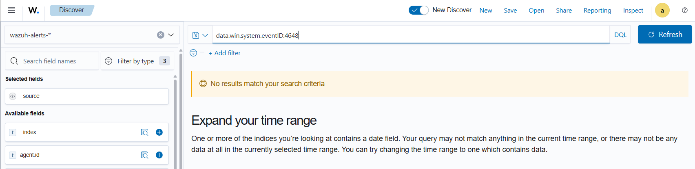
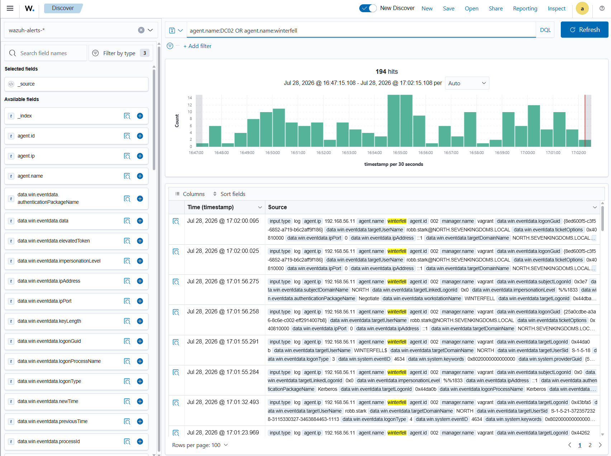

# ⚔️ Attaque 04 — LLMNR / NBT-NS Poisoning

| | |
|---|---|
| **Catégorie** | Credential Access |
| **MITRE ATT&CK** | [T1557.001](https://attack.mitre.org/techniques/T1557/001/) |
| **Fiche théorique** | [`../../docs/02-credential-access/`](../../docs/) |
| **Cible** | `north.sevenkingdoms.local` (DC02 / winterfell · 192.168.56.11) |
| **Compte attaquant** | aucun au départ — on **récolte** le hash de `robb.stark` |
| **Outil** | `Responder` (empoisonnement) + `hashcat` (crack) + `evil-winrm` (provocation) |
| **Statut détection Wazuh** | 🔴 Angle mort (empoisonnement réseau, invisible dans le bruit) |

---

## 1. 🧠 Description
Quand un poste Windows cherche à joindre une machine par son nom (ex : `\\srv-backup-old`), il interroge **d'abord le DNS**. **Si le DNS ne connaît pas le nom** (faute de frappe, serveur disparu…), Windows ne s'arrête pas là : il **crie sur tout le réseau local** *« quelqu'un connaît `srv-backup-old` ? »* via les protocoles **LLMNR** et **NBT-NS**.

**La faille :** personne ne vérifie **qui** répond. L'attaquant (`Responder`) écoute, répond *« oui c'est moi ! »* 🎭, et la victime — confiante — tente de **s'authentifier** auprès de lui, lui envoyant son **hash NTLM**. On le **craque** ensuite hors ligne pour obtenir le mot de passe en clair.

## 2. 🎯 Prérequis
- Un simple **accès au réseau local** (aucun compte requis au départ).
- Une machine victime qui fait une **résolution de nom qui échoue** (extrêmement courant en entreprise).

## 3. 💻 Exécution

### a) Lancer l'écoute empoisonnée (Responder)
```bash
cd ~/Responder && sudo python3 Responder.py -I vboxnet0 -v
```
→ tous les poisoners `LLMNR / NBT-NS / MDNS` passent `[ON]`, Responder écoute et **répond à toutes les requêtes de noms inconnus**.



### b) Provoquer la victime (déclencheur)
Depuis un shell sur DC02 (ici via `evil-winrm` avec le hash Administrator volé au [DCSync](06-dcsync.md)), on force une résolution de nom qui échoue :
```powershell
dir \\srv-backup-old\partage
```
→ winterfell cherche `srv-backup-old` → **échec DNS** → **cri LLMNR/NBT-NS** → Responder répond → **hash capturé**.

> 💡 **Bonus observé :** un bot GOAD (`robb.stark`) cherche en boucle un serveur inexistant (`Bravos`) → Responder récolte son hash **en continu, sans même provoquer** — l'attaque LLMNR à l'état pur.

### c) Casser le hash hors ligne (hashcat, mode 5500)
```bash
hashcat -m 5500 /tmp/robb.hash /tmp/wl.txt --force
```



## 4. 📤 Résultat
Hash **NTLMv1** de `NORTH\robb.stark` capturé puis **cassé en moins d'une seconde** → mot de passe en clair **`sexywolfy`**.

> ⚠️ Le lab renvoie du **NTLMv1** (protocole cryptographiquement cassé) : encore **pire** que le NTLMv2, il se craque quasi instantanément (crack.sh / hashcat). **Chaîne complète : empoisonnement → hash → mot de passe en clair.**

À l'arrêt de Responder (`Ctrl+C`), tous les hashs sont **automatiquement sauvegardés** dans `~/Responder/logs/` pour un crack ultérieur :



## 5. 🛡️ Détection dans Wazuh — 🔴 angle mort

| Recherche (DQL) | Résultat | Lecture |
|---|---|---|
| `data.win.eventdata.targetUserName:robb.stark` | **119 hits** | logons/logoffs **normaux** du bot (4624/4634, logonType 3) — rien ne distingue l'auth volée |
| `data.win.system.eventID:4648` | **0 hit** | l'Event « logon par identifiants explicites » **n'est pas audité** → le témoin manque |
| `agent.name:DC02` | **194 hits** | beaucoup d'activité, **aucune alerte** liée à l'empoisonnement |

**Event(s) Windows concerné(s) :** `4648` (idéalement) — absent ; les `4624/4634` présents sont indistinguables du trafic normal.

**a) `targetUserName:robb.stark` → 119 hits** : la victime apparaît partout, mais uniquement via des logons/logoffs **normaux** (l'attaque est là, **noyée dans le bruit**).



**b) `data.win.system.eventID:4648` → 0 hit** : l'événement qui trahirait l'auth sortante vers l'attaquant **n'est pas audité** — le témoin manque.



**c) `agent.name:DC02` → 194 hits** : beaucoup d'activité winterfell, mais **aucune alerte** liée à l'empoisonnement.



## 6. 🎓 Analyse & leçon
> **L'empoisonnement LLMNR est un angle mort du SIEM par défaut.** L'attaque se joue **sur le réseau** (Responder ↔ victime) et ne remonte **jamais** aux agents. Les logons de la victime **existent** dans Wazuh, mais sont **indistinguables** de l'activité légitime, et l'événement révélateur (`4648`, ou une auth vers l'IP de l'attaquant `192.168.56.1`) **n'est pas collecté**.

👉 Détecter LLMNR demande soit une **détection réseau** (repérer un hôte qui répond à des noms qu'il ne devrait pas résoudre), soit l'**audit du 4648 + corrélation** des authentifications vers des hôtes inattendus — objet des **Phases 5 (audits) & 6 (comportemental)**.

## 7. 🔧 Remédiation
- **Désactiver LLMNR** (GPO : *Turn OFF Multicast Name Resolution*) et **NBT-NS** (sur chaque interface).
- **Désactiver NTLMv1** partout et forcer NTLMv2 / Kerberos (SMB signing).
- Surveiller le trafic LLMNR/NBT-NS (détection réseau) et activer l'audit **4648**.

---

⬅️ Retour à l'[index des attaques](../03-attaques.md)
