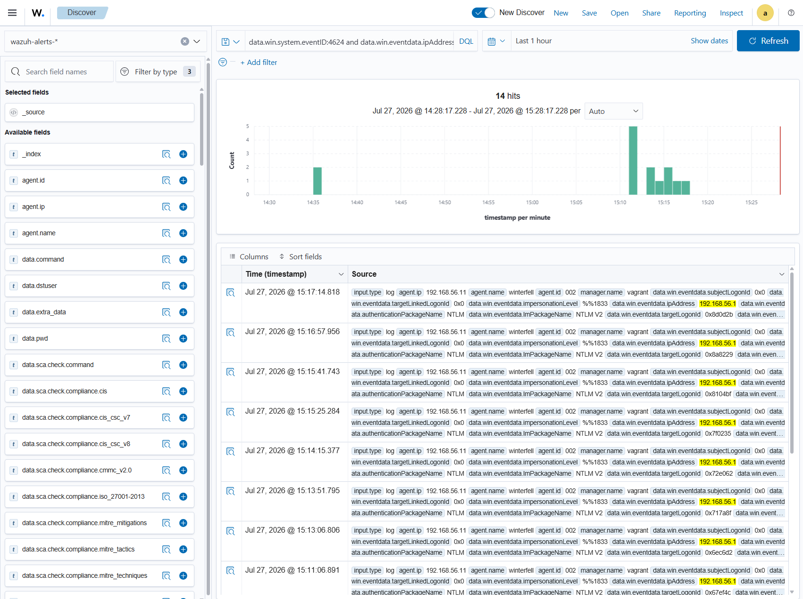

# ⚔️ Attaque 09 — Pass-the-Hash (PtH)

| | |
|---|---|
| **Catégorie** | Lateral Movement |
| **MITRE ATT&CK** | [T1550.002](https://attack.mitre.org/techniques/T1550/002/) |
| **Fiche théorique** | [`../../docs/03-lateral-movement/13-pass-the-hash.md`](../../docs/03-lateral-movement/13-pass-the-hash.md) |
| **Cible** | `north.sevenkingdoms.local` (DC02 / winterfell · 192.168.56.11) |
| **Compte attaquant** | `Administrator` (hash volé au **DCSync**) |
| **Outil** | evil-winrm (WinRM) |
| **Statut détection Wazuh** | 🟡 Partielle (connexions `4624` visibles mais non alertées) |

---

## 1. 🧠 Description
En NTLM, Windows n'utilise **pas le mot de passe en clair** mais le **hash NT** du mot de passe. Donc si un attaquant possède **le hash** (volé via DCSync, LSASS dump…), il peut s'authentifier **sans jamais connaître le mot de passe** : il **"passe le hash"**.

> Analogie 🎫 : le hash est une **empreinte** qui remplace le mot de passe. Voler l'empreinte suffit pour entrer.

C'est la **suite logique de DCSync** : DCSync vole les hashs → Pass-the-Hash les **utilise** pour prendre le contrôle.

## 2. 🎯 Prérequis
- Le **hash NT** d'un compte à privilèges (ici l'`Administrator` du domaine, récupéré au [DCSync](06-dcsync.md) : `dbd13e1c4e338284ac4e9874f7de6ef4`).
- Un service d'accès distant ouvert (WinRM 5985, activé sur les DC de GOAD).

## 3. 💻 Exécution
> Les outils impacket (`wmiexec`, `psexec`, `smbexec`, `atexec`) **authentifient bien par hash** mais leur canal de retour de sortie bloquait sur ces VM imbriquées (DCOM / named pipe / fichier de sortie). **WinRM** (via `evil-winrm`) donne un shell fiable :

```bash
evil-winrm -i 192.168.56.11 -u Administrator -H dbd13e1c4e338284ac4e9874f7de6ef4
```
| Élément | Rôle |
|---------|------|
| `evil-winrm` | shell distant via WinRM |
| `-i 192.168.56.11` | la cible (DC02 / winterfell) |
| `-u Administrator` | le compte usurpé |
| `-H dbd13e1c...` | **le hash NT** au lieu du mot de passe = **Pass-the-Hash** |


## 4. 📤 Résultat
Un **shell PowerShell interactif sur le contrôleur de domaine**, en tant que `north\administrator`, **sans aucun mot de passe** :
```
whoami   → north\administrator
hostname → winterfell
```
**Contrôle total du domaine `north.sevenkingdoms.local`.** Chaîne complète : **DCSync (vol) → Pass-the-Hash (usage) → domination.**

## 5. 🛡️ Détection dans Wazuh — 🟡 partielle
**Recherche (Threat Hunting → Events) :**
```
data.win.system.eventID:4624 and data.win.eventdata.ipAddress:192.168.56.1
```
**Event Windows concerné :** `4624` (*An account was successfully logged on*), type 3, `authenticationPackageName: NTLM`.

**Résultat : 14 hits** — les connexions **réussies** de l'attaquant (`Administrator` depuis `192.168.56.1`, NTLM) **sont bien collectées**. Mais elles **ressemblent à des connexions admin légitimes** → **non alertées** comme malveillantes par défaut.



## 6. 🎓 Analyse & leçon
> Le PtH via **WinRM est FURTIF** : contrairement à `psexec` (service → Event `7045`) ou `atexec` (tâche → Event `4698`), qui laissent des **artefacts bruyants**, WinRM ne laisse **qu'un `4624`** — une connexion qui passe pour légitime.

**Deux enseignements :**
- On détecte souvent une attaque par ses **effets de bord** (service/tâche créés), pas par l'auth elle-même.
- Détecter un PtH "propre" (WinRM) demande de **baseliner** le comportement (un admin qui se connecte depuis une IP/heure inhabituelle) → c'est précisément le rôle d'un **agent de détection d'anomalies / IA** (**Phase 6**).

## 7. 🔧 Remédiation
- **Empêcher le vol de hashs** en amont (protéger LSASS, limiter les Domain Admins, tiering).
- Activer **Credential Guard**, restreindre NTLM au profit de Kerberos.
- Surveiller les **connexions NTLM d'admins depuis des postes inhabituels** (détection comportementale, Phase 6).

---

⬅️ Retour à l'[index des attaques](../03-attaques.md)
